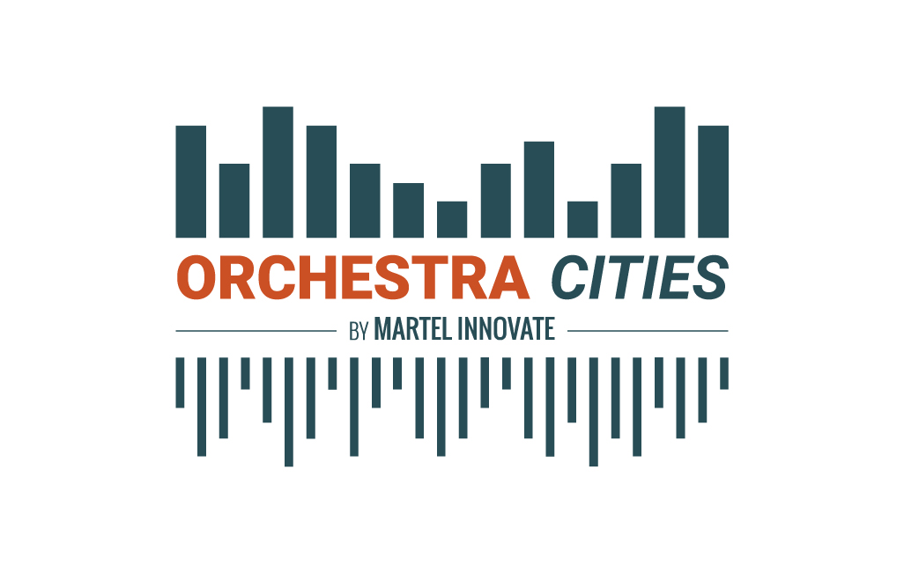

# Orchestra Cities 

**Orchestra Cities** is a data and IoT-driven solution that allows cities to
collaboratively develop and share Smart City Services using Open APIs and
Open Standards. Launched in 2018 by [Martel Innovate](https://www.martel-innovate.com),
Orchestra Cities was initially developed and tested with Antwerp and Helsinki
as solution for the [Select4Cities](https://www.select4cities.eu/)
Pre-Commercial Procurement (PCP). Following the PCP, Martel further invested
on the platform for the benefit of its customers.

## Documentation

This repository hosts the main documentation of Orchestra Cities.

It consists of an introduction, where the most important topics and ideas are
briefly introduced, and a tutorial, where the user can get a first hands-on
experience on the most important operations of the platform.

### Organisation

Documentation is found in the `docs` folder.

Write in plain markdown. Use figures accordingly.

Images and binary resources are saved in `docs/rsrc` folder. Respect the naming
schema of the files in there to keep it reasonably organised.

### Usage

1. Run `sh run.sh`
1. Open `http://127.0.0.1:8000/` in your explorer and you should see the docs
1. You can now edit them and changes will be reflected on the fly.
