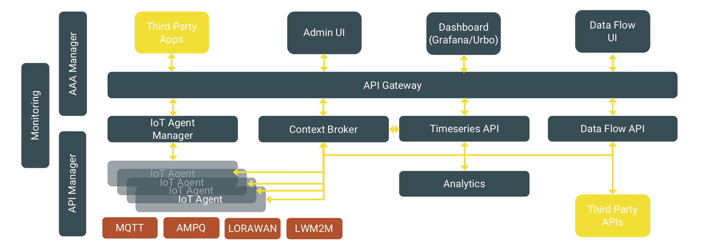
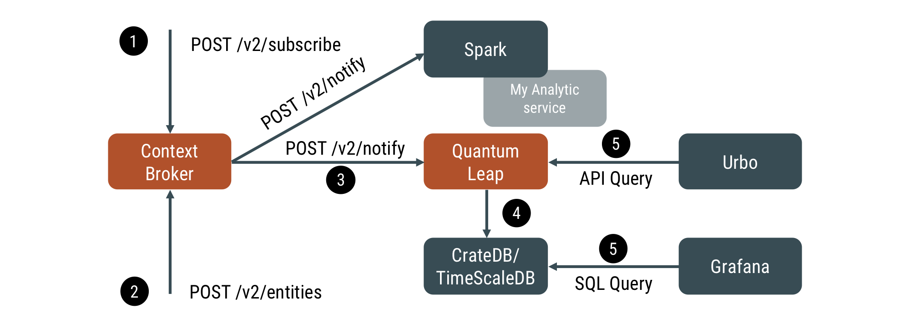

# 2. Architecture

The platform, as depicted in the picture above, is composed of different
microservices that are orchestrated using state-of-the-art solutions
such as Docker and Kubernetes.

## 2.1 Security

The core of the security management is based on [OIDC](https://openid.net/connect/)
and [OAUTH 2.0](https://oauth.net/2/) standards. The solution supports Identity,
Access and Organisation Management.

-   The Identity Management support enables it to manage single users
    (covering authentication aspects).

-   The Access Management supports the control of access of users to
    specific applications or platform services (e.g. dashboard) with a
    given role (e.g. editor), thus covering authorization and
    audit aspects.

-   The Organization Management support maps users to
    organizations (i.e. cities) so to host a multi-tenants within a
    single platform instance (i.e. different cities, same users)
    approach.

This solution, in combination with the support in the data management
layer of data partitioning by tenant, enables the secure and controlled
access by each tenant (e.g. a city) to its specific data. Moreover, it
empowers different users to have access to different city data spaces
with the same account.

The process works as follow:

1.  When an API request is generated by a client

1.  The token for the specific Application/Client is checked at Keycloak
    OAuth 2.0 API

1.  If the token is valid (i.e. authenticated and authorized for a given
    OAuth client), the policy extracts from the token the list of
    tenants and verifies that the requested tenant space is included in
    the ones accessible.

In case of success, the call will be forwarded to the API in the backend
(if not, the user will be returned a 401 “Not Authorized” response).

### 2.1.1 APIs

* [Keycloak Auth API](https://www.keycloak.org/docs/latest/authorization_services/#_service_overview)
* [Keycloak Admin API](https://www.keycloak.org/docs-api/5.0/rest-api/index.html)
* [Gravitee API](https://docs.gravitee.io/apim/1.x/management-api/1.30/)

### 2.1.2 Software used to realise this layer

* The open source solution adopted for the Identity and Access Management
is [Keycloak](https://www.keycloak.org/), the market-leading open source
identity and access management solution developed by RedHat.

    * Keycloak supports either [MySQL](https://www.mysql.com/)
      or [PostgreSQL](https://www.postgresql.org/) as backends.

* The adopted open source solution for API Management is [gravitee.io](https://gravitee.io/).
To apply access control to APIs, Gravitee offers a flexible plugin
mechanism to implement access control policies.

    * Gravitee requires [MongoDB](https://www.mongodb.com/) - for configuration -
      and [ElasticSearch](https://www.elastic.co/elasticsearch/) - for logs -
      as backends.

## 2.2 Data Management

The core of the data management is a Context Broker API collecting data from the
different sources and forwarding them to the different backend APIs
based on the specific scenarios.
All data used in the platform transits through it: IoT Devices data,
External services data, Platform generated data.

Context Broker supports different interaction modes. Services can
provide data to the Context Broker with the following modality:

-   Data Push: services send data to it.

-   Data Pull: services expose data via a standard API, that the Orion
    Context Broker queries to retrieve data.

-   Services can obtain data with the following modality:

    -   Data Subscription: services subscribe to a given data and get
        notified when the data is updated.

    -   Data Query: services query the Orion Context Broker to
        retrieve data.

These interaction modes provide a very flexible way to integrate data
provider (e.g. sensors) and data processing services (e.g. analytics).
In the case of IoT Agent, as discussed in the following section, the
recommended solution is the Data Push model (however the Data Pull model
is also supported), since this allows constantly up-to-date data in the
Orion Context Broker that can be used to generate Data Subscriptions.

The other core component of the Data Management layer is the Timeseries
API. The role of this component is to store all the historical data of a
given entity (Context Broker stores only the current value in time
of a data).

In short, the process will work as follows:

1.  A subscription is created for each data model (e.g. Weather), to get
    notifications forwarded to the Timeseries API service (e.g.
    Quantum Leap)

1.  Data of entities matching the created subscription gets updated in
    the Context Broker

1.  Notifications are sent to the subscribed services (e.g.
    Quantum Leap). Each notification includes the whole data model (or a
    fragment, depending on the subscription created).

1.  The subscribed service processes it using its logic (in the case of
    Quantum Leap, it stores the received data in CrateDB).

### 2.2.1 Software used to realise this layer

* The Context Broker API is provided by
[Orion](https://fiware-orion.readthedocs.io/en/master/),
the reference implementation for a NGSIv2 Context Broker.

    * Orion requires [MongoDB](https://www.mongodb.com/) as backend.

* The Timeseries API is provided by [Quantum Leap](https://quantumleap.readthedocs.io/en/latest/),
an NGSIv2 compliant time series API. Quantum Leap supports as backend
CrateDB, which is also supported by Grafana (see next section) to
generate dashboards. QuantumLeap supports a variety of queries
(including geographical-based), facilitating the access to historical
data by services in need of working on batch data sets..

    * Quantum Leap supports [CrateDB](https://crate.io/)
      or [Timescale](https://www.timescale.com/) as backends.

### 2.2.2 APIs

* [Orion API](https://fiware.github.io/specifications/ngsiv2/stable/)
* [QuantumLeap API](https://app.swaggerhub.com/apis/smartsdk/ngsi-tsdb)

## 2.3 Device Management

To manage the IoT devices, Orchestra Cities leverages FIWARE stack and
hence the NGSIv2 API and data format. FIWARE offers a wide range of
so-called IoT Agents. Each IoT Agent enables different transport and
message protocols to be used to connect IoT Devices. Orchestra Cities
covers all protocols supported by FIWARE (UL, JSON, LOWARAN), being the
recommended one UL, a very lightweight message protocol (e.g.
`attribute1|value1|attribute2|value2` becomes `t|10|s|true|l|78.8`) that
supports MQTT, AMQP or HTTP transports. The IoT Agent role is to map low
level messages generated by the device to higher level information used
at the so-called application layer and to forward the structured and
aggregated information to the data management layer of the platform.
FIWARE IoT Agents support the concept of “device groups”, i.e. a set of
devices sharing the same information model. This facilitates the
registration of a large set of devices that provides the same
information, which would otherwise have required the user to configure
one-by-one with device-specific information (if required at all).

To facilitate the registration of IoT Devices within IoT Agents, we
provide an UI, thus simplifying the overall operation. The process will
work as follow:

1.  Through the portal (or the API) a user can register a device

1.  The device configuration (which includes for example the transport,
    besides the attribute mapping discussed above) is stored in the
    device registry for later use

1.  Once configured, the device can send messages to the agent (in the
    picture, the HTTP transport is assumed)

1.  When receiving a payload, the Agent checks the configuration of the
    device to transform the incoming “simple” message into the NGSIv2
    payload

1.  Finally, the Agent sends the NGSIv2 payload to the Context Broker

### 2.3.1 Software used to realise this layer

* IoT Agent Manager, an API proxy that allows to access different services
  implementing FIWARE IoT Agent configuration APIs.

    * [IoT Agent Manager](https://github.com/telefonicaid/iotagent-manager) requires [MongoDB](https://www.mongodb.com/) as backend.

* IoT Agents, a set of services supporting integrate of sensors with
Context Broker. 

    * IoT Agents requires [MongoDB](https://www.mongodb.com/) as backend.

### 2.3.2 APIs

* [IoT Agent config API](https://iotagent-node-lib.readthedocs.io/en/latest/api/index.html)
* [IoT Agent UL API](https://fiware-iotagent-ul.readthedocs.io/en/latest/usermanual/index.html#api-overview)
* [IoT Agent JSON API](https://fiware-iotagent-json.readthedocs.io/en/latest/usermanual/index.html)

## 2.4 Dashboard Management

Orchestra Cities allows creation of dashboards to monitor and visualise
data. Dashboards include a set of “panels” that provides support for rendering
objects such as lines, points, bars and heat graphs, basic maps with
info pointers, picture panels and more useful panels to display
any kind of data. 
Dashboards can show online historical data while filtering and sorting data dynamically. The data can be zoomed in to have fine-grained views of values
or the same data can be seen in a Tabular format, allowing users to sort
data by different column values. The ability to present maps with information
points allows cities to visualize in real-time all the data that is
being collected by the sensors. Besides that, cities are able to define
actions based on the information and events of the dashboards and create
alerts based on data thresholds; for example set an alert when a waste
bin is on fire. Dashboards can be easily shared, customized and embedded
in other tools.

Dashboards can run on multiple end-user devices without
installation and provides good responsiveness for the dimensions of
desktop screens, mobile phones and tablets. 

### 2.4.1 Software used to realise this layer

Dashboards can be realised with two solutions:

* [Grafana](https://grafana.com/), an open platform
  for beautiful analytics and monitoring. Grafana includes a collection
  of data-source plugins, that allows it to integrate Grafana with
  different databases and backends such as Timescale and CrateDB
  (the back-ends of QuantumLeap), JSON, and Google calendar.

* [Urbo](https://github.com/GeographicaGS/UrboCore-www), an open source
  framework to develop elegant and interactive dashboards.

### 2.4.2 APIs

* [Grafana API](https://grafana.com/docs/grafana/latest/http_api/)
* [URBO API](https://github.com/GeographicaGS/UrboCore-api/tree/master/docs/reference)

## 2.5 Analytics

While the dashboard can provide simple real-time analytics, for more
complex tasks different solutions should be used. Depending on the
use case, we recommend to leverage Apache Spark or other solutions.
The different solutions, integrated to the Data Management layer, can
analyse data sets (e.g. Weather forecast) whether they are
real-time and/or historical data.

## 2.6 Data Integration

External data sources can be integrated via Context Broker API
or QuantumLeap API (in this case, no real time data will be available
for that data source).

This tool allows the creation of visual workflows for data injection into
the platform. Workflows support
web services, files and other sources and can be saved to replicable
templates so that different cities can instantiate and customise their
own data import flow for a given service.

###  2.6.1 Software used to realise this layer

To integrate external services and data sources, Orchestra Cities
currently leverages on Apache [NIFI](https://nifi.apache.org/) or
Stream Sets [Data Collector](https://streamsets.com/products/sdc).

For better performances, it is also
possible to develop python tasks.
In this case, no visual support will
be available to define the integration. Still you can leverage
[SDKs](https://github.com/orchestracities/sdk).