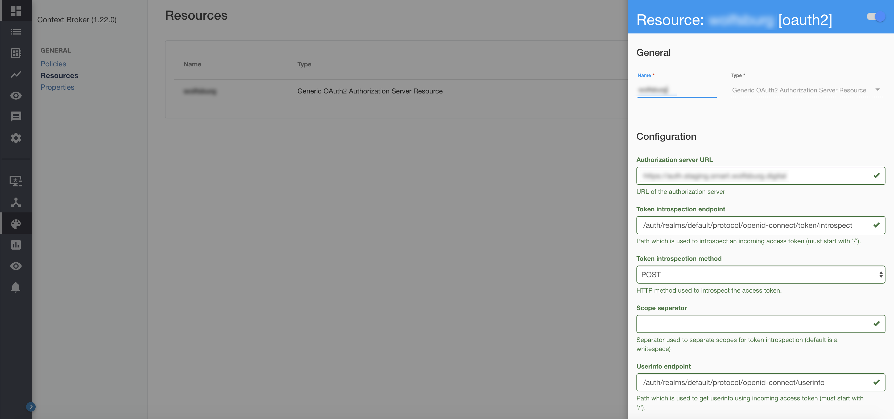
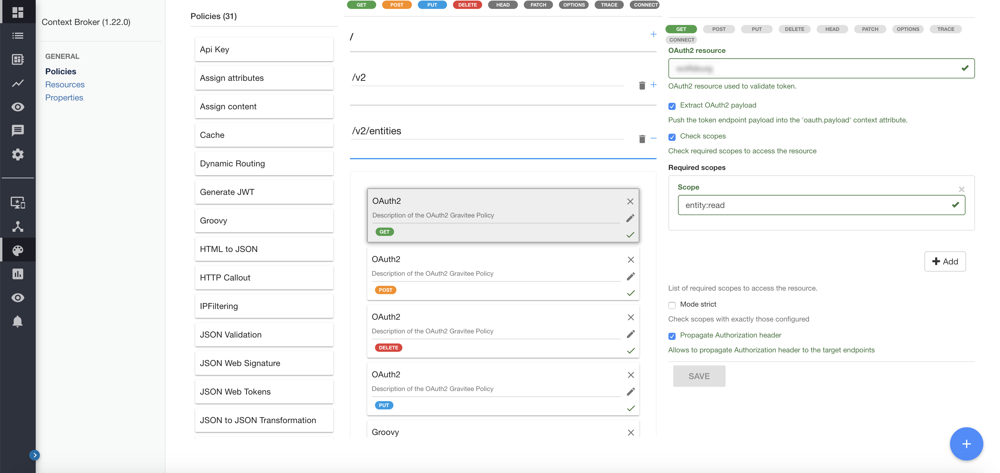

# 4.2. Api Management (Gravitee)

The Developer Portal is where the Orchestra Cities APIs are registered, and the
policies defined. The following section describes how these APIs are registered
in the Developer Portal and how policies and Oauth2 authorization are handled.

## The Authorization flow

1. The user requests a token for the client API from Keycloak. The token comes
   from a public client in Keycloak, so no secret is required to obtain a token.
   It's worth reminding that the public clients set up in Keycloak will
   limit what the given tokens enable users to do, such as user management operations.
   The user requests a specific scope with the request (e.g. entity:read). A list
   of scopes is available in the [**Keycloak Configuration**](/keycloak) section of this documentation.

2. When then token is used, it is validated against Keycloak's confidential client
   (the resource-server client). The operation being attempted (e.g. creating an
   entity under Tenant X and Servicepath Y) is allowed if the correct scope is
   present and the Tenant and Servicepath allow it.

3. The authorisation is carried out according to the contents of the token.

## Protecting an API

To set up and protect an API through the Gravitee Developer Portal, one must do
two things after registering the API: defining an Oauth2 resource to authenticate
and authorize users, and define for each path of the API which policies should be
applied.

### Oauth2 Resource



Within the Developer Portal, for each API, Oauth2 access to Keycloak is configured
as a Generic Oauth2 Authorization Server Resource. This is done to check tokens
against the confidential client resource-server in Keycloak, where scopes are
listed.

The configuration contains:

- **Authorization Server URL**: The Keycloak URL
- **Token introspection endpoint**: /auth/realms/default/protocol/openid-connect/token/introspect
- **Token introspection method**: POST
- **Userinfo endpoint**: /auth/realms/default/protocol/openid-connect/userinfo
- **Userinfo method**: GET
- **Client Id**: resource-server
- **Client secret**: The secret of the resource-server client
- **Authorization header**: Authorization
- **Authorization scheme**: Basic
- **Token query param name**: token
- **Form param name**: token


### Policies



For each API endpoint, policies are in place for each operation. This enables API
owners to decide exactly what scopes are required for users to perform different
operations, whether is accessing, editing, creating or deleting resources.
See the [**Keycloak Configuration**](/keycloak) section for more details on
client scopes.

Policies follow a basic syntax of resource:operation, so for the /entities endpoint
of the Context Broker for example we have:

- GET requires scope entity:read
- PUT requires scope entity:write
- POST requires scope entity:create
- DELETE requires scope entity:delete

In addition, there's a policy in the form of a Groovy script in place for all
operations that checks the Oauth payload for the `Tenant` and `ServicePath`,
ensuring the operation being performed is authorised.

The script:

```groovy
// The following scripts reads the token payload, extract the information about
// tenants and service paths, and authorises the user if the requested tenant and
// service paths are present. Returns 401 otherwise.
import io.gravitee.policy.groovy.PolicyResult.State
import groovy.json.JsonSlurper
import groovy.json.JsonOutput

def jsonSlurper = new JsonSlurper()

def authorised = false;

def content = null;

if(context.attributes['oauth.payload']){
	content =  jsonSlurper.parseText(context.attributes['oauth.payload']);
}

if (request.headers.containsKey('fiware-Service') && content) {
    def service = request.headers.get('fiware-Service').get(0)
  	if (content['fiware-services'].get(service)){
      	def serviceList = content['fiware-services'].get(service)
  		if (request.headers.containsKey('fiware-ServicePath')) {
    	  def servicePath = request.headers.get('fiware-ServicePath').get(0)
          authorised = serviceList.any{servicePath.startsWith(it)}
		}
    }
}

if (authorised == false) {
  	result.state = State.FAILURE;
	result.code = 401;
	result.error = '{"error":"Missing authorisation for specified fiware-service and fiware-servicePath","code":"UNAUTHORISED"}';
}
```
