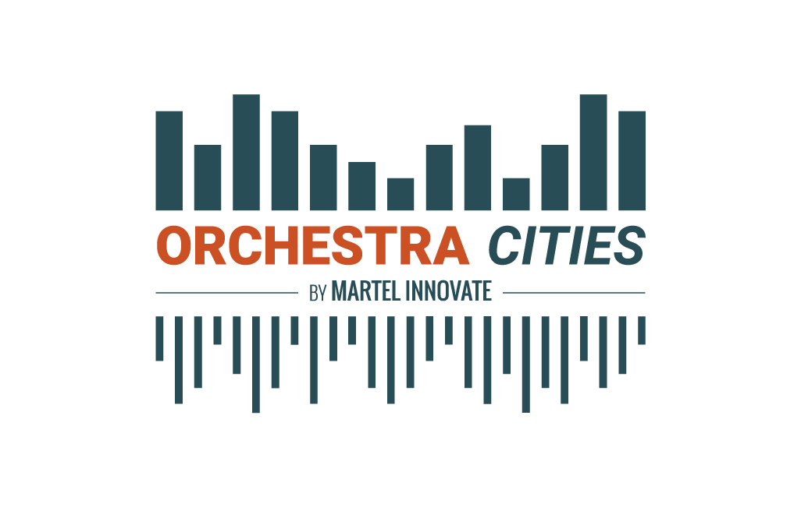

*Latest Update: 2020-07-26 13:36:41*

# 0. Introduction

This is the official documentation of **Orchestra Cities**.

**Orchestra Cities** is a data and IoT-driven solution that allows cities to
collaboratively develop and share Smart City Services using Open APIs and
Open Standards. Launched in 2018 by [Martel Innovate](https://www.martel-innovate.com),
Orchestra Cities was initially developed and tested with Antwerp and Helsinki
as solution for the [Select4Cities](https://www.select4cities.eu/)
Pre-Commercial Procurement (PCP). Following the PCP, Martel further invested
on the platform for the benefit of its customers.

[Martel Innovate](https://www.martel-innovate.com)
offers a commercial version of the platform and private deployment support
for it (for more information [OrchestraCities.com](https://orchestracities.com)).

The tutorial presented in this refers to endpoints the commercial platform
(which is the only public live instance available),
nevertheless you can apply the same tutorials for your own deployment
based on the open source tools that are composing the platform.

Orchestra Cities contributes and is based on [FIWARE](https://www.fiware.org).
