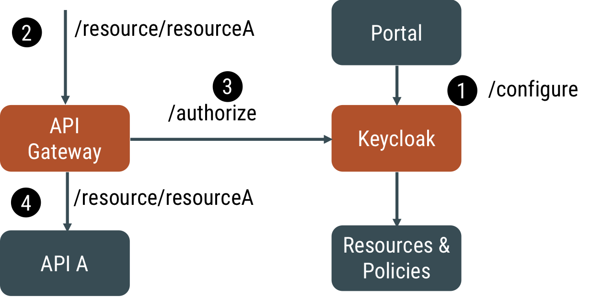
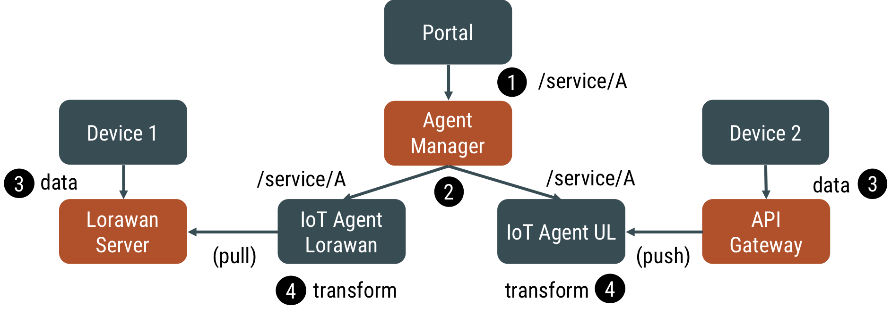
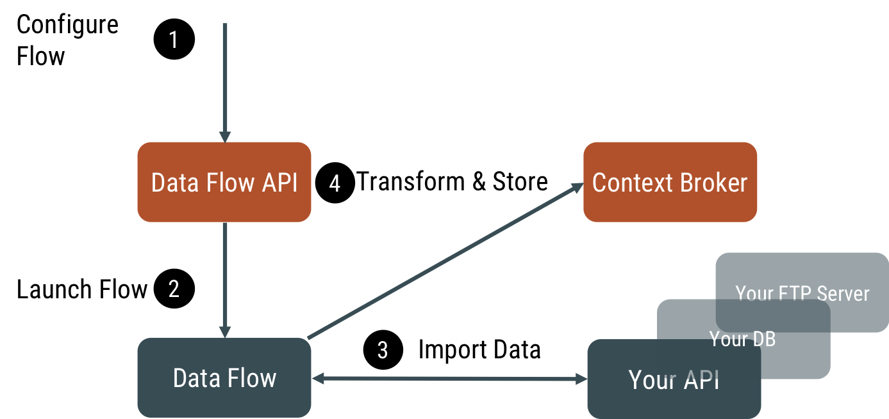

# Platform Overview

## Concept

The Smart City solutions market is mostly driven by large players that
rely on proprietary technologies. Only recently have a small niche of
solutions been adopting an Open approach. The forerunner technology in
this niche is [FIWARE](https://www.fiware.org), the most mature Open
Source framework available today dealing with requirements for Smart Cities.
The Orchestra Cities concept takes on FIWARE principles and strives to push
them further.

FIWARE is designed around the concept of Openness. Concretely this
means:

-   Open Standards

-   Open Data Models

-   Open APIS

Orchestra Cities embraces the above principles and aims to extend them
to enable City-to-City collaboration and Citizens-to-City collaboration.

Specifically, what does it mean? Orchestra Cities aims at building a
collaborative space for shaping a sustainable and participatory future
for our cities, where:

-   Citizens can share data from their devices with other citizens or
    with the city

-   Businesses can easily build services on top of APIs that are shared
    across different cities

-   Cities can benefit from data published by other cities to create
    analysis, comparisons and forecast

Orchestra Cities differs from other platforms in that it believes the
most efficient and effective way to achieve its goals is to support
multiple cities in a single platform. This approach brings several
advantages in terms of: costs, scalability and modularity.

### Key Technology Benefits

-   Support the migration from vertical data silos to a unified data
    space for a single integrated view over the city

-   A collaborative space where different cities can share data and
    services, while retaining control on their own data

-   Modular and flexible approach where each city can reserve just the
    needed services and quotas

-   Reduced ownerships costs thanks to the possibility of sharing the
    platform among different cities

-   Leverage Open Standards and Open Source code, thus building on the
    work of a large European and global community

-   Allow citizens and businesses to take part on the city services
    co-creation process

## Platform Overview

The platform, as depicted in the picture above, is composed of different
microservices that are orchestrated using state-of-the-art solutions
such as Docker and Kubernetes.

Orchestra Cities functionalities available as of today include:

-   Security Management.

-   Device Management

-   Data Management

-   Dashboard Management

-   Data Integration Management

### Security

The core of the security management is based on [OIDC](https://openid.net/connect/)
and [OAUTH 2.0](https://oauth.net/2/) standards. The solution supports Identity,
Access and Organisation Management.

-   The Identity Management support enables it to manage single users
    (covering authentication aspects).

-   The Access Management supports the control of access of users to
    specific applications or platform services (e.g. dashboard) with a
    given role (e.g. editor), thus covering authorization and
    audit aspects.

-   The Organization Management support maps users to
    organizations (i.e. cities) so to host a multi-tenants within a
    single platform instance (i.e. different cities, same users)
    approach.

This solution, in combination with the support in the data management
layer of data partitioning by tenant, enables the secure and controlled
access by each tenant (e.g. a city) to its specific data. Moreover, it
empowers different users to have access to different city data spaces
with the same account.

The open source solution adopted for the Identity and Access Management
is [Keycloak](https://www.keycloak.org/), the market-leading open source
identity and access management solution developed by RedHat.

The adopted open source solution for API Management is [gravitee.io](https://gravitee.io/).
To apply access control to APIs, Gravitee offers a flexible plugin
mechanism to implement access control policies.

The process works as follow:

1.  When an API request is generated by a client

1.  The token for the specific Application/Client is checked at Keycloak
    OAuth 2.0 API

1.  If the token is valid (i.e. authenticated and authorized for a given
    OAuth client), the policy extracts from the token the list of
    tenants and verifies that the requested tenant space is included in
    the ones accessible.

In case of success, the call will be forwarded to the API in the backend
(if not, the user will be returned a 401 “Not Authorized” response).

### Data Management

The core of the data management is a “data bus” collecting data from the
different sources and forwarding them to the different backend APIs
based on the specific scenarios. This “data bus” is provided by
[Orion Context Broker](https://fiware-orion.readthedocs.io/en/master/),
the reference implementation for a NGSIv2 broker.
All data used in the platform transits through it: IoT Devices data,
External services data, Platform generated data.

Orion Context Broker supports different interaction modes. Services can
provide data to the Orion Context Broker with the following modality:

-   Data Push: services send data to it.

-   Data Pull: services expose data via a standard API, that the Orion
    Context Broker queries to retrieve data.

-   Services can obtain data with the following modality:

    -   Data Subscription: services subscribe to a given data and get
        notified when the data is updated.

    -   Data Query: services query the Orion Context Broker to
        retrieve data.

These interaction modes provide a very flexible way to integrate data
provider (e.g. sensors) and data processing services (e.g. analytics).
In the case of IoT Agent, as discussed in the following section, the
recommended solution is the Data Push model (however the Data Pull model
is also supported), since this allows constantly up-to-date data in the
Orion Context Broker that can be used to generate Data Subscriptions.

The other core component of the Data Management layer is the Timeseries
API. The role of this component is to store all the historical data of a
given entity (Orion Context Broker stores only the current value in time
of a data). The Timeseries API is provided by [Quantum Leap](https://quantumleap.readthedocs.io/en/latest/),
an NGSIv2 compliant time series API. Quantum Leap supports as backend
CrateDB, which is also supported by Grafana (see next section) to
generate dashboards. QuantumLeap supports a variety of queries
(including geographical-based), facilitating the access to historical
data by services in need of working on batch data sets.

In short, the process will work as follows:

1.  A subscription is created for each data model (e.g. Weather), to get
    notifications forwarded to the Timeseries API service (e.g.
    Quantum Leap)

1.  Data of entities matching the created subscription gets updated in
    the Context Broker

1.  Notifications are sent to the subscribed services (e.g.
    Quantum Leap). Each notification includes the whole data model (or a
    fragment, depending on the subscription created).

1.  The subscribed service processes it using its logic (in the case of
    Quantum Leap, it stores the received data in CrateDB).

### Device Management

To manage the IoT devices, Orchestra Cities leverages FIWARE stack and
hence the NGSIv2 API and data format. FIWARE offers a wide range of
so-called IoT Agents. Each IoT Agent enables different transport and
message protocols to be used to connect IoT Devices. Orchestra Cities
covers all protocols supported by FIWARE (UL, JSON, LOWARAN), being the
recommended one UL, a very lightweight message protocol (e.g.
attribute1|value1|attribute2|value2 becomes t|10|s|true|l|78.8) that
supports MQTT, AMQP or HTTP transports. The IoT Agent role is to map low
level messages generated by the device to higher level information used
at the so-called application layer and to forward the structured and
aggregated information to the data management layer of the platform.
FIWARE IoT Agents support the concept of “device groups”, i.e. a set of
devices sharing the same information model. This facilitates the
registration of a large set of devices that provides the same
information, which would otherwise have required the user to configure
one-by-one with device-specific information (if required at all).

To facilitate the registration of IoT Devices within IoT Agents, we
provide an UI, thus simplifying the overall operation. The process will
work as follow:

1.  Through the portal (or the API) a user can register a device

1.  The device configuration (which includes for example the transport,
    besides the attribute mapping discussed above) is stored in the
    device registry for later use

1.  Once configured, the device can send messages to the agent (in the
    picture, the HTTP transport is assumed)

1.  When receiving a payload, the Agent checks the configuration of the
    device to transform the incoming “simple” message into the NGSIv2
    payload

1.  Finally, the Agent sends the NGSIv2 payload to the Context Broker

### Dashboard Management

To allow the creation of custom dashboards, we use an open-source
dashboard engine called [Grafana](https://grafana.com/), an open platform
for beautiful analytics and monitoring. This technology integrates a set of
“panels” that provides support for rendering objects such as lines, points, bars
and heat graphs, basic maps with info pointers, picture panels and more
useful panels to display any kind of data. It also includes a collection
of data-source plugins, that allows it to integrate Grafana with
different databases and backends such as Crate (the back-end of Quantum
Leap), JSON, and Google calendar. Grafana aims to provide an easy and
intuitive way for public officers to monitor different KPIs of their
city. This dashboard can run on multiple end-user devices without
installation and provides good responsiveness for the dimensions of
desktop screens, mobile phones and tablets. Also, it can show online
historical data while filtering and sorting data dynamically. The data
can be zoomed in to have fine-grained views of values or the same data
can be seen in a Tabular format, allowing users to sort data by
different column values. The ability to present maps with information
points allows cities to visualize in real-time all the data that is
being collected by the sensors. Besides that, cities are able to define
actions based on the information and events of the dashboards and create
alerts based on data thresholds; for example set an alert when a waste
bin is on fire. Dashboards can be easily shared, customized and embedded
in other tools.

### Analytics

While the dashboard can provide simple real-time analytics, for more
complex tasks we integrated an Apache Spark cluster in the platform.
The cluster, integrated to the Data Management layer, enables the
analysis of a data set (e.g. Weather forecast) whether they are
real-time and/or historical data.

### Data Integration

To integrate external services and data sources, Orchestra Cities
currently leverages on Apache [NIFI](https://nifi.apache.org/) or
Stream Sets [Data Collector](https://streamsets.com/products/sdc).
This tool allows the creation of visual workflows for data injection into
the platform. Workflows support
web services, files and other sources and can be saved to replicable
templates so that different cities can instantiate and customise their
own data import flow for a given service.

## Open Standards

Orchestra Cities relies on different Open Standards that facilitates the
integration with existing solutions.

| Layer        | Standards                                    |
|--------------|------------------------------------------------|
| Security     | OAUTH 2.0, OIDC, SAML, KERBEROS, LDAP, X.509 |
| IoT          | Protocols: UL, JSON, LWM2M                   |
|              | Transport: HTTP, COAP, MQTT, AMQP, LORAWAN   |
| Data Exchange| Protocols: JSON/REST, XML/SOAP, FTP/HTTP, WEBSOCKETS |
|              | Data format: NGSI, JSON, GEOJSON, CSV, EXCEL, TEXT
| Cloud        | Docker, Kubernetes |
