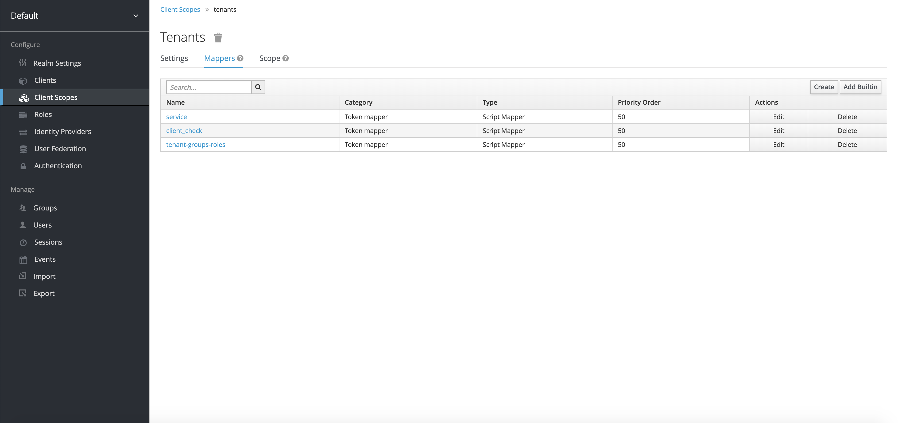

# Keycloak

Keycloak is used to both authenticate and authorise users who wish to access the
Orchestra Cities resources through the APIs.

## Keycloak Clients

Keycloak allows the definition of clients to handle authorisation and authentication
of users from different services in Orchestra Cities.

With the Portal for instance there is a Keycloak client, the `portal` client, used
by the Portal's frontend to authenticate a user, meaning it allows them to log into
the Portal with their Keycloak account. In addition, it allows them to request
scopes for the operations they want to perform, such as editing or creating resources.

The `portal` client in Keycloak is set up as a public client, meaning it requires no
client-secret to access. Because of this, it is set up to not allow external users to modify
roles and scopes attached to it. Another client is set up within Keycloak, called
the `resource_server` client, that is internally used by Orchestra Cities services
and APIs to authorise users, meaning verifying that those requesting to perform
a certain operations (e.g. deleting a resource) are effectively allowed to do so.


The `resource_server` is essentially the central element used to govern access to
the Orchestra Cities resources by its various services. Public clients, such as the
`portal` and `api` clients in Keycloak, are used to authenticate users. But it's
then the `resource_server` that takes care of actually authorising their actions,
effectively creating a security separation layer between them.

The portal client in Keycloak is set up as public, meaning it doesn't
require a secret to access. This client is used by the portal to authenticate users,
like those logging into the Portal's frontend. Being public, it is not configured to
give control over client scopes and roles.


The resource-server client is confidential, meaning that its client-secret
is needed in order to authenticate against it. The portal's backend uses this client
to authorise actions, like creating or deleting resources through the APIs.
This is done by creating a list of roles for the resource-server client, which are
then assigned to groups the users can belong to, which in term define the actions
the users are allowed to perform.

To perform actions that involve altering Keycloak Users and Groups from
the Keycloak API, the Portal does have access to the default admin client within
a Keycloak realm (by default named admin-cli).

## Client Scopes

The following roles are created in the resource-server client, and are assigned
as optional client scopes:

- **entity:read**, for reading/GET operations of Context Broker entities
- **entity:write**, for editing/PUT operations of Context Broker entities
- **entity:create**, for creating/POST operations of Context Broker entities
- **entity:delete**, for deleting/DELETE operations of Context Broker entities
- **subscription:read**, for reading/GET operations of Context Broker subscriptions
- **subscription:write**, for editing/PUT operations of Context Broker subscriptions
- **subscription:create**, for creating/POST operations of Context Broker subscriptions
- **subscription:delete**, for deleting/DELETE operations of Context Broker subscriptions
- **device:read**, for reading/GET operations of Context Broker devices
- **device:write**, for editing/PUT operations of Context Broker devices
- **device:create**, for creating/POST operations of Context Broker devices
- **device:delete**, for deleting/DELETE operations of Context Broker devices
- **devicegroup:read**, for reading/GET operations of Context Broker device groups
- **devicegroup:write**, for editing/PUT operations of Context Broker device groups
- **devicegroup:create**, for creating/POST operations of Context Broker device groups
- **devicegroup:delete**, for deleting/DELETE operations of Context Broker device groups
- **endpoint:read**, for reading/GET operations of registered endpoints in the Portal
- **endpoint:write**, for editing/PUT operations of registered endpoints in the Portal
- **endpoint:create**, for creating/POST operations of registered endpoints in the Portal
- **endpoint:delete**, for deleting/DELETE operations of registered endpoints in the Portal
- **group:read**, for reading/GET operations of user groups in Keycloak
- **group:write**, for editing/PUT operations of user groups in Keycloak
- **group:create**, for creating/POST operations of user groups in Keycloak
- **group:delete**, for deleting/DELETE operations of user groups in Keycloak
- **user:read**, for reading/GET operations of users in Keycloak
- **user:write**, for editing/PUT operations of users in Keycloak
- **user:create**, for creating/POST operations of users in Keycloak
- **user:delete**, for deleting/DELETE operations of users in Keycloak
- **urbo:roles**, for accessing roles in Keycloak

These represent both the resource being acted upon, and the action being
taken: reading, writing, creating and deleting. In order for a user to be authorised
to perform a certain action, they need to belong to a Keycloak Group that has the
corresponding role, where said Group is subgroup of the relevant Tenant.

The default client scopes roles and tenants are also assigned to both resource_server
and the portal client, the latter containing script mappers described in the
Keycloak Mappers section below.

## Tenants and Groups in Keycloak

Tenants in Keycloak are represented as Groups. Subgroups of these Tenant Groups
represent both the Service Paths used by the Orchestra Cities APIs, and the
larger "roles" that users can have within Tenants (Admin, Developer, User, Device).


Tenant Groups are marked are such with the attributes "tenant" and "service"
within Keycloak, whilst Service Path groups are marked with the attribute "servicePath".

This entire setup is done in order to provide multy-tenancy support, whilst
keeping everything in a single Keycloak realm. Keycloak can easily track what tenants
users have a role in by having them registered to the associated subgroup (e.g. Admin of
City_X), and the scopes these subgroups allow (e.g. viewing/editing/creating/deleting
devices registered and so on).

## Keycloak mappers



In order to integrate other Orchestra Cities services, such as the Portal, a series
of Script Mappers were created as part of Client Scopes. This was done in order
to include in the tokens given out by Keycloak the necessary information on
Services/Tenants and Service Paths, as well as groups and scopes for the roles.

Example of access token get:

```json
{
    "access_token": "eyJhbGciOiJSUzI1NiIsInR5cCIgOiAiSldUIiwia2lkIiA6ICJwb1A0UHVVdDZBOWYxODcxSGRzQ1MtQnRZdEo3MTVHaVZPclVJdGZCMGN3In0.eyJqdGkiOiIyMjY1NTk1ZS04ODg2LTRjMzktOGU3NS1lNDMyYTU4YjEwNzMiLCJleHAiOjE1OTE2NDQ4MjcsIm5iZiI6MCwiaWF0IjoxNTkxNjA4ODI3LCJpc3MiOiJodHRwczovL2F1dGguZWt6Lm9yY2hlc3RyYWNpdGllcy5jb20vYXV0aC9yZWFsbXMvZGVmYXVsdCIsInN1YiI6IjFjNGY5ZjgyLWU1YTctNGIzMi04NGVhLWExNzc0NTMxZjFkMiIsInR5cCI6IkJlYXJlciIsImF6cCI6ImFwaSIsImF1dGhfdGltZSI6MCwic2Vzc2lvbl9zdGF0ZSI6IjhkYzc1MWFjLTVjN2ItNGI3Yy05ZGQ0LTlkZDBkZjI2NzYzMiIsImFjciI6IjEiLCJzY29wZSI6InByb2ZpbGUgZW1haWwgdGVuYW50cyIsImZpd2FyZS1zZXJ2aWNlcyI6eyJFS1oiOlsiL1BhcmtpbmdNYW5hZ2VtZW50IiwiL1BhcmtpbmdNYW5hZ2VtZW50L1BuaSIsIi9Qb3dlck1hbmFnZW1lbnQvRXNhdmUiLCIvTW9iaWxpdHlNYW5hZ2VtZW50IiwiL0Vudmlyb25tZW50TWFuYWdlbWVudC9PcGVuV2VhdGhlciIsIi9FbnZpcm9ubWVudE1hbmFnZW1lbnQvU21hcnRTZW5zZSIsIi9UcmFmZmljTWFuYWdlbWVudC9EZW1vIiwiL1Bvd2VyTWFuYWdlbWVudCIsIi9FbnZpcm9ubWVudE1hbmFnZW1lbnQvRGVtbyIsIi9FbnZpcm9ubWVudE1hbmFnZW1lbnQvS2VhY291c3RpY3MiLCIvUGFya2luZ01hbmFnZW1lbnQvRGVtbyIsIi9Qb3dlck1hbmFnZW1lbnQvRGF0YWtvcnVtIiwiL0Vudmlyb25tZW50TWFuYWdlbWVudC9EZWNlbnRsYWIiLCIvUGFya2luZ01hbmFnZW1lbnQvRGF0YWtvcnVtIiwiL0Vudmlyb25tZW50TWFuYWdlbWVudC9BZXJvcXVhbCIsIi9FbnZpcm9ubWVudE1hbmFnZW1lbnQvRGF0YWtvcnVtIiwiL1BhcmtpbmdNYW5hZ2VtZW50L05lZGFwIiwiL1BhcmtpbmdNYW5hZ2VtZW50L09wZW5DaGFyZ2VNYXAiLCIvRW52aXJvbm1lbnRNYW5hZ2VtZW50L1dBUUkiLCIvSW5mcmFzdHJ1Y3R1cmVNYW5hZ2VtZW50IiwiL1BhcmtpbmdNYW5hZ2VtZW50L0NsZXZlcmNpdGkiLCIvV2FzdGVNYW5hZ2VtZW50IiwiL0luZnJhc3RydWN0dXJlTWFuYWdlbWVudC9EZWNlbnRsYWIiLCIvVHJhZmZpY01hbmFnZW1lbnQiLCIvRW52aXJvbm1lbnRNYW5hZ2VtZW50L0Nlc3ZhIiwiL1RyYWZmaWNNYW5hZ2VtZW50L0hFUkUiLCIvRW52aXJvbm1lbnRNYW5hZ2VtZW50L0hhd2FEYXdhIiwiL0Vudmlyb25tZW50TWFuYWdlbWVudCIsIi9QYXJraW5nTWFuYWdlbWVudC9FS1oiXX0sImVtYWlsX3ZlcmlmaWVkIjp0cnVlLCJuYW1lIjoiR2FicmllbGUgQ2VyZm9nbGlvIiwicHJlZmVycmVkX3VzZXJuYW1lIjoiZ2FicmllbGUuY2VyZm9nbGlvQG1hcnRlbC1pbm5vdmF0ZS5jb20iLCJsb2NhbGUiOiJlbiIsImdpdmVuX25hbWUiOiJHYWJyaWVsZSIsImZhbWlseV9uYW1lIjoiQ2VyZm9nbGlvIiwiZW1haWwiOiJnYWJyaWVsZS5jZXJmb2dsaW9AbWFydGVsLWlubm92YXRlLmNvbSJ9.EGaR0TiHySOCWBJCU_-dDq5Sr-FaosBPRE97xrhud1d5aIOipW-3M1qJjtQzN7uMrk1ZHYpHghsJhs43_WtzreyjP2Tqf_C9JukSqjN954sGeEipvrH1Nqp2iV7eoAK9cUBJUbEL9qTghbn2wpEj5jzM37lO43IPzpgd3t6scKFfsYiU3BqZox4DHF7ThSxlW22t_CNBZ4zYVlLHEAthXN-vXIGOZGQwDkW3UpWjHXPy4KS5wlQim_BqEAb234QJOAyJe0yaDBQPH2ifEDVeXAbe0fwdnUobKCftg8DNf2-RVIFvVG8h6JGNGVnkdxlmHf9Pt-bI9ZRvshLw5RM_xg",
    "expires_in": 36000,
    "refresh_expires_in": 3600,
    "refresh_token": "eyJhbGciOiJIUzI1NiIsInR5cCIgOiAiSldUIiwia2lkIiA6ICI5M2YyZjY0Yy1hMWUzLTRmNzgtYTkzOC0wMTY4ZWQxYTU4MDkifQ.eyJqdGkiOiIyMTE3NjVlYy0wMTE4LTRjMTEtYTIxYy1lODliZDhkMjE0YzYiLCJleHAiOjE1OTE2MTI0MjcsIm5iZiI6MCwiaWF0IjoxNTkxNjA4ODI3LCJpc3MiOiJodHRwczovL2F1dGguZWt6Lm9yY2hlc3RyYWNpdGllcy5jb20vYXV0aC9yZWFsbXMvZGVmYXVsdCIsImF1ZCI6Imh0dHBzOi8vYXV0aC5la3oub3JjaGVzdHJhY2l0aWVzLmNvbS9hdXRoL3JlYWxtcy9kZWZhdWx0Iiwic3ViIjoiMWM0ZjlmODItZTVhNy00YjMyLTg0ZWEtYTE3NzQ1MzFmMWQyIiwidHlwIjoiUmVmcmVzaCIsImF6cCI6ImFwaSIsImF1dGhfdGltZSI6MCwic2Vzc2lvbl9zdGF0ZSI6IjhkYzc1MWFjLTVjN2ItNGI3Yy05ZGQ0LTlkZDBkZjI2NzYzMiIsInNjb3BlIjoicHJvZmlsZSBlbWFpbCB0ZW5hbnRzIn0.ExKfKX-D3WbUvtrA0N5DYDIr00L7TjBh-TbRC2yYUAo",
    "token_type": "bearer",
    "not-before-policy": 0,
    "session_state": "8dc751ac-5c7b-4b7c-9dd4-9dd0df267632",
    "scope": "profile email tenants"
}
```

Example of userinfo endpoint response using the above token:

```json
{
    "sub": "1c4f9f82-e5a7-4b32-84ea-a1774531f1d2",
    "tenants": [
        {
            "name": "Tenant_A",
            "groups": [
                {
                    "parent": "Tenant_A",
                    "realmRoles": [
                        "data-admin"
                    ],
                    "name": "Admin",
                    "is_servicepath": false,
                    "clientRoles": [
                        "uma_protection",
                        "endpoint:create",
                        "device:data",
                        "user:delete",
                        "subscription:read",
                        "endpoint:read",
                        "device:create",
                        "devicegroup:write",
                        "group:delete",
                        "registration:write",
                        "entity:create",
                        "devicegroup:read",
                        "alarm:delete",
                        "registration:read",
                        "registration:delete",
                        "entity:write",
                        "alarm:create",
                        "user:write",
                        "subscription:delete",
                        "device:delete",
                        "device:write",
                        "entity:delete",
                        "group:create",
                        "device:read",
                        "alarm:write",
                        "group:write",
                        "registration:create",
                        "subscription:write",
                        "entitytype:read",
                        "group:read",
                        "subscription:create",
                        "entity:op",
                        "devicegroup:create",
                        "endpoint:delete",
                        "user:read",
                        "endpoint:write",
                        "entity:read",
                        "user:create",
                        "devicegroup:delete",
                        "alarm:read"
                    ]
                },
                {
                    "parent": "Tenant_A",
                    "realmRoles": [
                        "offline_access"
                    ],
                    "name": "Developer",
                    "is_servicepath": false,
                    "clientRoles": [
                        "entity:delete",
                        "device:read",
                        "device:data",
                        "subscription:write",
                        "entitytype:read",
                        "subscription:read",
                        "endpoint:read",
                        "subscription:create",
                        "device:create",
                        "entity:op",
                        "devicegroup:create",
                        "devicegroup:write",
                        "registration:write",
                        "endpoint:write",
                        "entity:read",
                        "entity:create",
                        "devicegroup:read",
                        "registration:read",
                        "entity:write",
                        "alarm:read",
                        "subscription:delete",
                        "device:write"
                    ]
                },
                {
                    "parent": "Tenant_A",
                    "realmRoles": [],
                    "name": "EnvironmentManagement",
                    "is_servicepath": true
                }
            ],
            "id": "7ce9ae2a-b80b-4d67-b7ab-efc02f85183f"
        }
    ],
    "fiware-services": {
        "Tenant_A": [
            "/EnvironmentManagement"
        ]
    },
    "email_verified": true,
    "client_check": "api",
    "name": "User A",
    "preferred_username": "user_a",
    "locale": "en",
    "given_name": "User",
    "family_name": "A",
    "email": "user.a@gmail.com"
}
```

The client scope **Tenant** is set up with the following script mappers:

**Service**:

```javascript
// This script finds all the groups marked to represent service paths with, and
// adds a map of them and their tenants to the token. See section above
// for an example.
var HashMap = Java.type('java.util.HashMap');
var HashSet = Java.type('java.util.HashSet');
var ModelToRepresentation = Java.type('org.keycloak.models.utils.ModelToRepresentation');
var groups = user.getGroups();
var services = new HashMap();

groups.forEach(scanTenant);
groups.forEach(scanServicePath);

function scanTenant(group){
    if ( isTenant(group)===true ) {
        if ( services.get(group.getName()) === null ) {
            var servicePath = new HashSet();
            services.put(group.getName(), servicePath);
        }
    } else if( group !== null && group.getParent() !== null ) {
        scanTenant(group.getParent());
    }
}

function scanServicePath(group){
    if ( isServicePath(group)===true ) {
        if ( services.get(getRoot(group).getName()) ){
            var servicePath = Java.type('java.util.HashSet');
            servicePath = services.get(getRoot(group).getName()) ;
            var fullServicePath = ModelToRepresentation.buildGroupPath(group).substring(("/"+getRoot(group).getName()).length);
            servicePath.add(fullServicePath);
        }
    }
    if( group.getParent() !== null ) {
        scanServicePath(group.getParent());
    }
}

function getRoot(group){
    if(group.getParent() !== null)
        return getRoot(group.getParent());
    return group;
}


function isServicePath(group){
    if (group.getFirstAttribute("servicePath") == "true")  
        return true;
    return false;
}

function isTenant(group){
    if (group.getParent()===null &&
        group.getFirstAttribute("tenant") == "true"){
        if (services.get(group.getName()) === null) {
            var servicePath = new HashSet();
            services.put(group.getName(), servicePath);
        }
        return true;
    }
    return false;
}

token.setOtherClaims("fiware-services", services);
```

**Client_check**

```javascript
// Add the clientID to the token
var clientId = keycloakSession.getContext().getClient().getClientId();
token.setOtherClaims("client_check", clientId);
```

**Tenant-groups-roles**

```javascript
// Scans for the groups marked as tenants, and constructs an object to list the
// subgroups marked as user roles, and includes their scopes. See section above
// for an example.
var HashMap = Java.type('java.util.HashMap');
var HashSet = Java.type('java.util.HashSet');
var ArrayList = Java.type('java.util.ArrayList');
var ModelToRepresentation = Java.type('org.keycloak.models.utils.ModelToRepresentation');
var groups = user.getGroups();
var tenants = new ArrayList();

groups.forEach(scanTenant);
groups.forEach(scanGroups);

function scanTenant(group){
    if ( isTenant(group)===true ) {
        found = getTenant(group.getName());
        if ( !found ) {
            var groups = new ArrayList();
            var tenant = new HashMap();
            tenant.put("id",group.getId());
            tenant.put("name",group.getName());
            tenant.put("groups",groups);
            tenants.add(tenant);
        }
    } else if( group !== null && group.getParent() !== null ) {
        scanTenant(group.getParent());
    }
}

function scanGroups(group){
    if ( isTenant(group)===false )  {
        found = getTenant(getRoot(group).getName());
        if ( found ) {
            groups = found.get("groups");
            current = getGroup(groups, group.getName());
            if (! current ){
                var newGroup = new HashMap();
                newGroup.put("name", group.getName());
                newGroup.put("is_servicepath", isServicePath(group));
                newGroup.put("parent", group.getParent().getName());
                var rep = ModelToRepresentation.toRepresentation(group, true);
                if (rep.getRealmRoles())
                    newGroup.put("realmRoles",rep.getRealmRoles());
                if( keycloakSession.getContext().getClient()){
                    var clientId = "resource_server";
                    //var clientId = keycloakSession.getContext().getClient().getClientId();
                    if(rep.getClientRoles().get(clientId)) newGroup.put("clientRoles",rep.getClientRoles().get(clientId));
                } else {
                    var clients = realm.getClients();
                     for (i= 0; i<clients.size(); i++){
                        item = clients.get(i);
                        var clientId = item.getClientId();
                        if(rep.getClientRoles().get(clientId)) newGroup.put(clientId,rep.getClientRoles().get(clientId));
                    }
                }
                groups.add(newGroup);
            }
        }
    }
    if( group.getParent() !== null ) {
        scanGroups(group.getParent());
    }
}

function getTenant(name){
    for (i= 0; i<tenants.size(); i++){
        item = tenants.get(i);
        if (item.get("name")===name)
            return item;
    }
    return null;
}

function getGroup(groups, name){
    for (i= 0; i<groups.size(); i++){
        item = groups.get(i);
        if (item.get("name")===name)
            return item;
    }
    return null;
}

function getRoot(group){
    if(group.getParent() !== null)
        return getRoot(group.getParent());
    return group;
}


function isServicePath(group){
    if (group.getFirstAttribute("servicePath") == "true" || group.getFirstAttribute("servicepath") == "true")  
        return true;
    return false;
}

function isTenant(group){
    if (group.getParent()===null &&
        group.getFirstAttribute("tenant") == "true"){
        return true;
    }
    return false;
}

token.setOtherClaims("tenants", tenants);
```

In addition, under the scope **Tenant-names** the script **Only-tenant-names**
was set up:

```javascript
// This script gets the names of the groups marked as tenants, and adds them to
// the token
var HashMap = Java.type('java.util.HashMap');
var HashSet = Java.type('java.util.HashSet');
var ArrayList = Java.type('java.util.ArrayList');
var ModelToRepresentation = Java.type('org.keycloak.models.utils.ModelToRepresentation');
var groups = user.getGroups();
var tenants = new ArrayList();

groups.forEach(scanTenant);

function scanTenant(group){
    if ( isTenant(group)===true ) {
        found = getTenant(group.getName());
        if ( !found ) {
            tenants.add(group.getName());
        }
    } else if( group !== null && group.getParent() !== null ) {
        scanTenant(group.getParent());
    }
}

function getTenant(name){
    for (i= 0; i<tenants.size(); i++){
        item = tenants.get(i);
        if (item===name)
            return item;
    }
    return null;
}

function getRoot(group){
    if(group.getParent() !== null)
        return getRoot(group.getParent());
    return group;
}


function isTenant(group){
    if (group.getParent()===null &&
        group.getFirstAttribute("tenant") == "true"){
        return true;
    }
    return false;
}

token.setOtherClaims("tenants", tenants);
```

## Protecting Web applications that don't support natively OIDC/OAUTH

Not all web applications natively support OIDC or OAUTH, which is what Keycloak
uses for authentication. In order to protect these web applications, we use an
Oauth Proxy, which allows any HTTP endpoint to authenticate against an OIDC provider,
such as Keycloak.


The authentication flows within Keycloak need to be configured with the following
auth types:

- **Required Admin Role Flow Forms** as an alternative
- A **Script** for a data-admin check, set as required.

The script is as follows:

```javascript
AuthenticationFlowError = Java.type("org.keycloak.authentication.AuthenticationFlowError");
function authenticate(context) {

    if(user.hasRole(realm.getRole("data-admin"))){
        context.success();
        return;
    }

    context.failure(AuthenticationFlowError.INVALID_USER);
}
```
