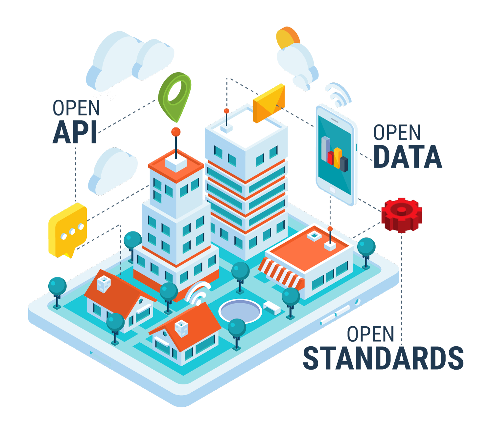

# 1. Platform overview

## Concept

The Smart City solutions market is mostly driven by large players that
rely on proprietary technologies. Only recently have a small niche of
solutions been adopting an Open approach. The forerunner technology in
this niche is [FIWARE](https://www.fiware.org), the most mature Open
Source framework available today dealing with requirements for Smart Cities.
The Orchestra Cities concept takes on FIWARE principles and strives to push
them further.

FIWARE is designed around the concept of Openness. Concretely this
means:

-   Open Standards

-   Open Data Models

-   Open APIS

Orchestra Cities embraces the above principles and aims to extend them
to enable City-to-City collaboration and Citizens-to-City collaboration.

Specifically, what does it mean? Orchestra Cities aims at building a
collaborative space for shaping a sustainable and participatory future
for our cities, where:

-   Citizens can share data from their devices with other citizens or
    with the city

-   Businesses can easily build services on top of APIs that are shared
    across different cities

-   Cities can benefit from data published by other cities to create
    analysis, comparisons and forecast

Orchestra Cities differs from other platforms in that it believes the
most efficient and effective way to achieve its goals is to support
multiple cities in a single platform. This approach brings several
advantages in terms of: costs, scalability and modularity.

### Key Technology Benefits

-   Support the migration from vertical data silos to a unified data
    space for a single integrated view over the city

-   A collaborative space where different cities can share data and
    services, while retaining control on their own data

-   Modular and flexible approach where each city can reserve just the
    needed services and quotas

-   Reduced ownerships costs thanks to the possibility of sharing the
    platform among different cities

-   Leverage Open Standards and Open Source code, thus building on the
    work of a large European and global community

-   Allow citizens and businesses to take part on the city services
    co-creation process

## Features Overview

Orchestra Cities features include:

*   Security Management
    * Multi-tenancy
        * Share users across tenants
        * Define different data spaces inside a each tenant.
    * User management 
        * Create a groups
        * Create roles
        * Assign roles to groups
        * Assign user to groups
    * Leverage common standards for authentication
        * OIDC based authentication of UI services
        * OAuth based authentication of API services
        * Two factor authentication
        * Integrate with existing authentication
          providers using: LDAP, Kerberos, OpenID Connect and SAML 2.0
    * Brute force detection
    * Multi language management UI

*   Device Management
    * Manage device groups (share data model across different
      devices and protocols/transports)
    * Map device attributes to multiple entities
    * Perform attribute transformation and aggregation
    * Support of different protocols and transports:
        * Protocols:  UL, JSON, LWM2M, CayenneLpp, CBOR
        * Transports: HTTP, COAP, MQTT, AMQP, LORAWAN, SIGFOX
        * Library to integrate additional protocols and transports.
    * Realtime communication for IoT devices, supporting: 
        * Telemetry: Reading out devices, for example temperature;
        * Inquiries: Devices that ask information from the platform to initiate activities;
        * Commands: Send commands to devices to perform specific tasks;
        * Notifications: send out notifications to devices
    * Multi language management UI

*   Data Management
    * Data harmonisation leveraging open data models.
    * Realtime data management
      * CRUD operation over realtime data
      * Register data providers
        (retrieve data from external services)
      * Send notifications on data updates to other APIs
    * Historical data management
      * Query specific entities over time and space
      * Query specific attributes over time and space
      * Query specific entity type over time and space
    * Define alarms on data frequency
    * Multi language management UI

*   Dashboard Management
    * Visual design of dashboards (with Grafana)
    * Support different visualisations: Maps, Graphs,
      Charts, Histograms, Heatmaps.
    * Filter and explore data.
    * Combine multiple data source in a single dashboard
    * Define alarms based on data queries (with Grafana).
    * Responsive design.
    * Share dashboard and embed them.

*   Data and Service Integration Management
  * API management
    * Define custom access plan to APIs
    * Provide API documentation
    * Allow developers to monitor their queries
  * Visual development of data and service integration flows.
    * Import different formats of files, such as CSV, XML, JSON;
    * Integrate with different services of existing back-end applications.
  * SDK for programmatic integration of data and services.

*   Platform
    * Microservice and cloud-native architecture (requires k8s)
        * Runs on kubernetes (AWS, Azure, Google, baremetal, ...)
        * Supports autoscaling
        * Supports self-healing
    * Monitoring
        * Services availability via heartbeat
        * Services failure notification (Slack or Email)

### Scenarios
While this repository doesn't provide any open source pre-configure dashboard, MARTEL developed dashboards for the a number of domains, including:
* Environmental Monitoring:
    * Air Quality Monitoring
    * Noise Monitoring
    * Water Level
* Mobility Monitoring
    * Traffic Monitoring
    * Parking Monitoring
    * Electric Vehicle Chargers Monitoring
* Streetlight Monitoring
* Waste Monitoring

## Open Standards

Orchestra Cities relies on different Open Standards that facilitates the
integration with existing solutions.

| Layer        | Standards                                    |
|--------------|------------------------------------------------|
| Security     | OAUTH 2.0, OIDC, SAML, KERBEROS, LDAP, X.509 |
| IoT          | Protocols: UL, JSON, LWM2M                   |
|              | Transport: HTTP, COAP, MQTT, AMQP, LORAWAN   |
| Data Exchange| Protocols: JSON/REST, XML/SOAP, FTP/HTTP, WEBSOCKETS |
|              | Data format: NGSI, JSON, GEOJSON, CSV, EXCEL, TEXT |
