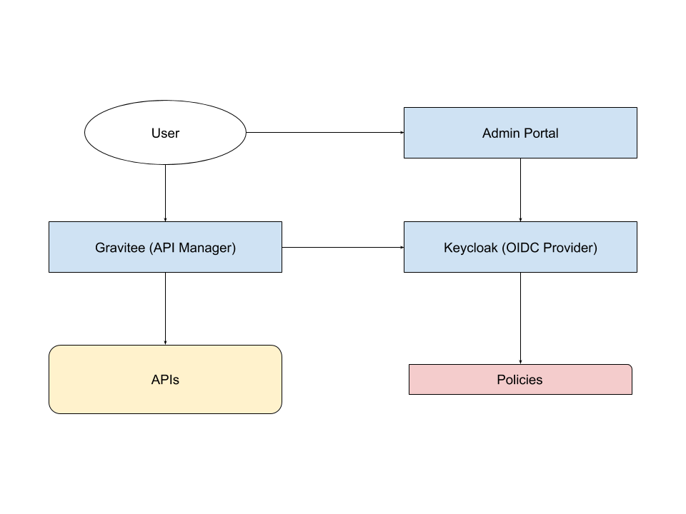

## Services

The security is managed using the following services:
- **Keycloak** (OIDC Provider): provides Authentication, Authorisation and
  Accounting for User and ODIC/OAuth Clients
- **Gravitee** (API Manager): provides, in combination with Keycloak, Authentication,
  Authorisation and Accounting for APIs
- **Admin Portal**: provides ways to manage Tenants (*Service*, in FIWARE terminology),
  Users within a Tenant, Groups within a Tenant and ServicePaths (specific to FIWARE APIs)

Users can access the APIs of the Orchestra Cities Services, which are protected
behind the Gravitee API Manager. They can also interact with Orchestra Cities
resources via the Admin Portal, which provides an interface to manage resources
mainly from the Context Broker (Devices, Entities and subscriptions), as well as
the users of the platform and their roles within it, across multiple Tenants.

Both Gravitee and the Admin Portal authorise and authenticate users through
Keycloak, which acts as an OpenIdConnect/Oauth2 provider. Through Keycloak users
are logged into the various Orchestra Cities services, and thanks to client scopes
policies can be enforced. 
