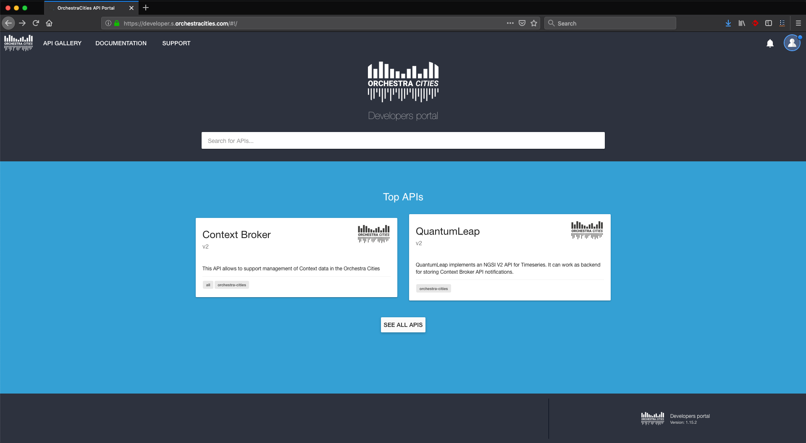
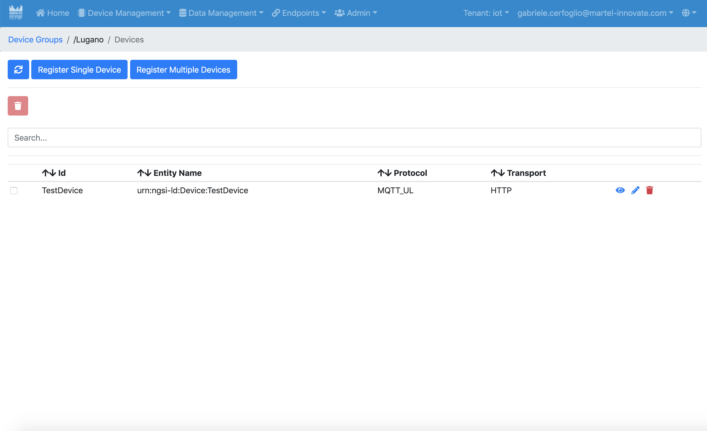
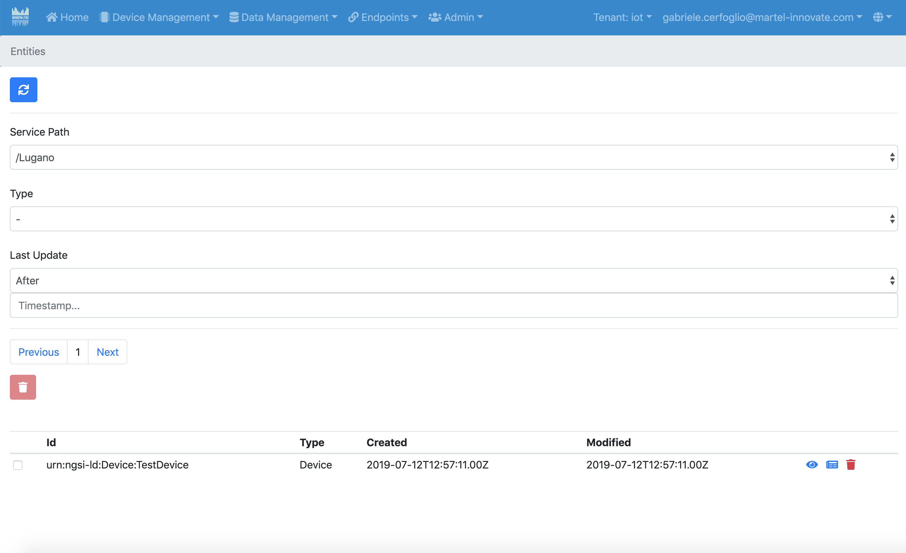
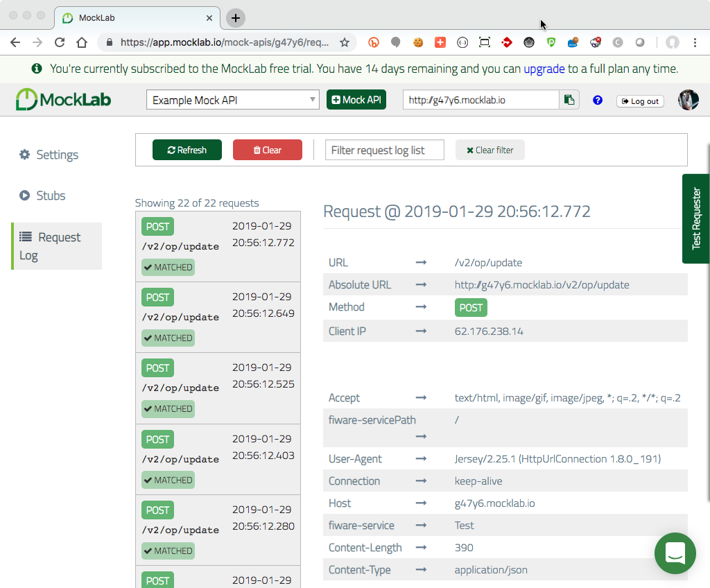
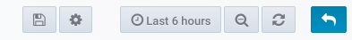

# 5. Tutorial

This tutorial will cover the main activities you can perform in the different
services composing OrchestraCities. For your convenience, you will find links
to all the services at the homepage of the [**Portal**][1].

Many of the steps of this tutorial are given as curl commands, but if you are
familiar with [Postman](https://www.getpostman.com/), we have a collection at
[/docs/rsrc/](rsrc/Orchestra API tests.postman_collection.json) that you may
want to import to make things easier. To use it, you will need to define a
[Postman Environment](https://learning.getpostman.com/docs/postman/environments_and_globals/manage_environments/)
with the following variables:

| Postman Variable Name | Value |
| --------------| ----- |
| {{server}}    | auth.s.orchestracities.com/auth/realms/default |
| {{apiServer}} | api.s.orchestracities.com |
| {{username}}  | your orchestracities account email |
| {{password}}  | your orchestracities account password |
| {{client_id}} | resource_server |
| {{client_secret}} | get the secret of the resource_server client from [Keycloak's api][2] |
| {{token}}     | this will be set for you when you follow User API Authentication section |

## 5.1 User Management

User Management can be performed directly inside of Keycloak's admin UI, or
through the Portal's UI.

### 5.1.1 Create a user with Keycloak

To create a new user, log into [Keycloak's admin UI][2].
Make sure your Keycloak account has admin privileges on Keycloak to allow for
the creation of new users and assigning roles to them.


From the Keycloak Admin UI, select "Users" on the left sidebar, and from there
click on "Add User". Fill in the new User's details and click on "Save".

Back on the Users page, find the newly created User and click on it to bring up
its details page. Under the groups tab, add the user to at least one tenant
group for the Portal, in this case it should be "OrchestraCities".

### 5.1.2 Create a user with the Portal

To create a new user, log into the [Portal][1]. Your Keycloak account needs to
have the required privileges to do so just like with the Keycloak Admin UI
procedure. If your account does, select on the nav bar the tenant you want the
new User under, then click on Admin, and then Users.


From there you can click on New User to bring up a User creation form. Fill in the
required details and create a new User from there. Note: a User must be added
to at least one Group to start, so ensure at least one Group exists.

### 5.1.3 Create Service Groups with Keycloak

From the Keycloak Admin UI, select "Groups" on the left sidebar. You'll be
presented with a list of groups and subgroups. The root groups represent the
tenants, while their subgroups are either Service Groups or User Groups.


To create a new Service Group for the "OrchestraCities" tenant, click on "OrchestraCities"
(do not worry if it doesn't look like it's being highlighted), and then click
"New" on the top right. Enter a name for the new Service Group and click "save".
The new group should now appear under "OrchestraCities". In order to define it as a
Service Group, click on it and then click 'edit' on the top right. On this new
page, select the "Attributes" tab. From here, add two new attributes with keys
"servicepath" and "servicePath", both with values set to "true". Make sure to
click the "add" button on the right for each before clicking "save" at the
bottom.


### 5.1.4 Create User Groups and Assign User Roles with Keycloak

Creating User Groups is similar to creating Service Groups. Once again, go to
the "Groups" page, click on "OrchestraCities" and then click "New". Enter a name for
the new User Group, and click "save". Now click on the newly created group and
then on "Edit". This time, select the "Role Mappings" tab. Here you will see
a section for "Realm Roles", and a dropdown menu for "Client Roles". From that
dropdown menu select "resource_server". This will bring up three lists for
"Available Roles", "Assigned Roles", and "Effective Roles". You can select
entries in either the "Available Roles" or the "Assigned Roles" to add or remove
roles from this User Group, which include the ability to read, create, write
(edit) or delete for Device, Device Groups, Entities and so on. Adding or
removing Roles will automatically set those Roles to the group, no need to click
on any save button this time.


### 5.1.5 Add users to User Groups or Service Groups with Keycloak

In order to give a User the Roles from the new User Group, and to give them
permission for the new Service Group the User needs to become a member of those
groups. To do this, select "Users" from the left sidebar. From this page, locate
the User you want to alter by searching for its username, or click "View all
users" and find it from the full list. Once found, click on their id on the
leftmost column. On this new page, click on the "Groups" tab. You'll see a list
Groups the User belongs to, and one of the available Groups for the User to join.
Select the User Group and the Service Group you created under "OrchestraCities" and
click on "Join". They should appear now under "Group Membership". The User is
now member of those Groups. Removing a User from a Group can be done similarly
by selecting the Group they belong to and clicking "Leave".


### 5.1.6 Create Groups and assign Roles and Users with the Portal

As previously done when creating Users, log into the Portal and click on Admin,
selecting Groups from the dropdown menu this time.


Clicking on Create Group will bring back a form to create a new Group, and assign
to it the roles you want the Users belonging to it to have. Once created, clicking
on the eye icon next to a Group's name will allow you to add Users to it by entering
their username, and altering the roles if needed.

It's also possible to create Service Path Groups from the Admin/Service Paths
section of the Portal. It can be done directly from that page, and Users can be
added just as with the User Groups.

### 5.1.7 User API Authentication

With the following token you will be able to authenticate to OC APIs.
The cloud hosted platform at the time being requires a `client_secret`, which
you need to obtain from OrchestraCities team.

1. Obtain a token with your email and password:

    You will need to replace in the following command your `{{username}}`, your
    `{{password}}` and the `{{client_secret}}` which you will find in the
    `Credentials` tab of the `resource_server` client in the `Clients` list of
    [Keycloak's Admin Page][2].

        curl --request POST \
          --url https://auth.s.orchestracities.com/auth/realms/default/protocol/openid-connect/token \
          --header 'Content-Type: application/x-www-form-urlencoded' \
          --data 'username={{username}}&password={{password}}&grant_type=password&client_id=resource_server&client_secret={{client_secret}}'

    Response:

        {
            "access_token": "eyJhbGciOiJSUzI1NiIsInR5cCIgOiAiSldUIiwia2l...",
            "expires_in": 36000,
            "refresh_expires_in": 3600,
            "refresh_token": "eyJhbGciOiJSUzI1NiIsInR5cCIg...",
            "token_type": "bearer",
            "not-before-policy": 0,
            "session_state": "849d007b-93b3-4a5d-87e8-653cd774485b"
        }

1. Validate your token (to see that the token actually works fine):

    You will need to replace in the following command your `{{client_secret}}`
    and the `{{access_token}}` you received in the previous step.

        curl --request POST \
          --url https://auth.s.orchestracities/auth/realms/default/protocol/openid-connect/token/introspect \
          --header 'Content-Type: application/x-www-form-urlencoded' \
          --data 'client_id=resource_server&client_secret={{client_secret}}&token={{access_token}}'

    Response:

        {
            "jti": "a2a1231-4328-4328-b471-2e630d2553f",
            "exp": 1550258044,
            "nbf": 0,
            "iat": 1550222044,
            "iss": "https://auth.s.orchestracities.com/auth/realms/default",
            "aud": "resource_server",
            "sub": "f2845018-6218-4b22-83d6-8b26681367e4",
            "typ": "Bearer",
            "azp": "resource_server",
            "auth_time": 0,
            "session_state": "57edaf48-6e72-4860-9c37-cbf29f39d6e1",
            "name": "developer developer",
            "given_name": "developer",
            "family_name": "developer",
            "preferred_username": "developer@orchestracities.com",
            "email": "developer@orchestracities.com",
            "acr": "1",
            "fiware-services": {
                "OrchestraCities": [
                    "/WasteManagement",
                    "/ParkingManagement",
                    "/MobilityManagement",
                    "/EnvironmentManagement"
                ],
                "Wolfsburg": [
                    "/WasteManagement",
                    "/ParkingManagement",
                    "/EnvironmentManagement"
                ]
            },
            "scope": [
              ...
            ],
            "client_id": "resource_server",
            "username": "developer@orchestracities.com",
            "active": true
        }

## 5.2 Getting Access to APIs

Access to the APIS of the different services composing OrchestraCities is
governed by the [API Gateway][3], which is based on [Gravitee](https://gravitee.io/)

This is the tool used to manage the access to the APIS, for example through the
definition of access plans (and quotas on the number of requests per unit of
time). For this tutorial, you may want to request an `apiKey` for the services
being queried afterwards so as not to be bothered with reaching quota limits.

The final goal is to get an `apiKey`, which you will store in your **Postman**
configuration as explained in the beginning of this tutorial, or you'll use in
the curl commands to replace `{{X-Gravitee-Api-Key}}` when needed.

The process is quite similar for the different services (Orion,
QuantumLeap, etc.) You need to follow these steps.

1. Go to the [API Gateway][3] and login with your credentials.



1. Click on *SEE ALL APIS* and pick the api you want a key for

1. In this example, we chose **Context Broker**


1. Scroll down a bit and click *Subscribe* to any plan that allows a reasonable
number of requests for your need.


1. You will be asked to pick an application. You can use the
*Default application* for now. Click Subscribe.

1. Someone (an administrator) will have to approve your request.

1. You will be notified when your request is approved, and you will be able to
get your `apiKey` from the *subscription* part of the left menu.


## 5.3 Register a device

### 5.3.1 Register a device using APIs

In order to receive data from the devices, first you need to register the device
in the IoT Agent. For that, you need to create the device groups and the devices.
Device Groups are a simple way to provide a shared configuration among different
devices (also across multiple `protocols`).

First of all you should pick one of the `protocols` available in the platform.
You can query them using:

    curl --request GET \
      --url https://api.s.orchestracities.com/iot/config/protocols/ \
      --header 'Authorization: Bearer {{token}}' \
      --header 'Content: application/json'

The response will look like:

```
{
    "count": 3,
    "protocols": [
        {
            "__v": 0,
            "_id": "5aa28f51bf77b0d245058c35",
            "description": "OMA LWM2M IoT Agent COAP protocol (Node.js version)",
            "protocol": "COAP",
            "resource": "/iot/d"
        },
        {
            "__v": 0,
            "_id": "5c6715da1794d4000e790d82",
            "description": "Ultralight 2.0 IoT Agent (Node.js version) supports HTTP/MQTT/AMQP protocols",
            "protocol": "UL",
            "resource": "/iot/ul"
        },
        {
            "__v": 0,
            "_id": "5c671c811794d4000e790dbf",
            "description": "JSON IoT Agent (Node.js version) supports HTTP/MQTT/AMQP protocols",
            "protocol": "JSON",
            "resource": "/iot/json"
        }
    ]
}
```

In the following we use the UL Agent as example. Similarly you will be able
to use other available protocols. Be aware that the OC cloud instance, compared
to official FIWARE IoT Agents, poses some restrictions:

* Device Group `key` is automatically computed, thus, if you inject it, it will
  be replaced.
* Resource is automatically computed as well, based on the `protocol` selected,
  e.g. for `UL` protocol, the resource would be `/iot/ul`.
* In the cloud platform, `cbroker` is not supported, since the platform allows
  agents to communicate only with the context broker offered by the platform.

#### 5.3.1.1 Device Groups Operations

To interact with a specific protocol, you will need to used the `protocol`
parameter to every call.

##### 5.3.1.1.1 Create

```
curl -X POST \
  https://api.s.orchestracities.com/iot/config/services?protocol=UL \
  -H 'Authorization: Bearer {{token}}' \
  -H 'Cache-Control: no-cache' \
  -H 'Content-Type: application/json' \
  -H 'Fiware-Service: OrchestraCities' \
  -H 'Fiware-ServicePath: /WasteManagement' \
  -H 'X-Gravitee-Api-Key: {{X-Gravitee-Api-Key}}' \
  -d '{
	"services": [
	   {
	     "entity_type": "WasteContainer",
       "internal_attributes": [],
       "attributes": [
           {
               "type": "Number",
               "name": "temperature",
               "object_id": "t"
           },
           {
               "type": "geo:point",
               "name": "location",
               "object_id": "l"
           },
           {
               "type": "Text",
               "name": "description",
               "object_id": "d"
           },
           {
               "type": "Text",
               "name": "status",
               "object_id": "S"
           },
           {
               "type": "Number",
               "name": "proximity",
               "object_id": "p"
           },
           {
               "expression": "${(@deviceHeight - @proximity) / @deviceHeight}",
               "type": "Number",
               "name": "fillingLevel",
               "object_id": "fillingLevel"
           }
       ],
       "lazy": [],
       "static_attributes": [
           {
               "value": "160",
               "type": "Number",
               "name": "deviceHeight"
           },
           {
               "name": "simulated",
               "type": "Boolean",
               "value": "false"
           }
       ],
       "commands": []
	   }
	]
}'
```

This request creates the Device Group for the Waste devices. For the Parking
devices you must update the value of `entity_type` to `ParkingSpot` and the
`Fiware-ServicePath` to `ParkingManagement`.

##### 5.3.1.1.2 Update
To update a Service Group, you need to know its key:

```
curl -iX PUT \
  'https://api.s.orchestracities.com/iot/config/services?apikey=T3JjaGVzdHJhQ2l0aWVzOi9XYXN0ZU1hbmFnZW1lbnQ6V2FzdGVDb250YWluZXI6MQ==&protocol=UL' \
  -H 'Authorization: Bearer {{token}}' \
  -H 'Cache-Control: no-cache' \
  -H 'Content-Type: application/json' \
  -H 'Fiware-Service: OrchestraCities' \
  -H 'Fiware-ServicePath: /WasteManagement' \
  -H 'X-Gravitee-Api-Key: {{X-Gravitee-Api-Key}}' \
  -d '{
  "entity_type": "WasteContainerUpdate"
}'
```

This request will update the value for the field `entity_type` for the service
group with apikey `T3JjaGVzdHJhQ2l0aWVzOi9XYXN0ZU1hbmFnZW1lbnQ6V2FzdGVDb250YWluZXI6MQ==` for the specified `Fiware-Service` and `Fiware-ServicePath`.

##### 5.3.1.1.3. Delete

Similarly, to delete a Device Group:

```
curl -X DELETE \
  'https://api.s.orchestracities.com/iot/config/services?apikey=T3JjaGVzdHJhQ2l0aWVzOi9XYXN0ZU1hbmFnZW1lbnQ6V2FzdGVDb250YWluZXI6MQ==&protocol=UL' \
  -H 'Authorization: Bearer {{token}}' \
  -H 'Cache-Control: no-cache' \
  -H 'Fiware-Service: OrchestraCities' \
  -H 'Fiware-ServicePath: /WasteManagement' \
  -H 'X-Gravitee-Api-Key: {{X-Gravitee-Api-Key}}' \
```

More operations (and examples) related with the services groups can be found
[here](https://github.com/Fiware/tutorials.IoT-Agent#service-group-crud-actions).

#### 5.3.1.2 Devices Operations

Device creation works in a similar way. Devices are coupled to the Device Group,
based on `Fiware-Service` and `Fiware-ServicePath` and `entity_type`.

##### 5.3.1.2.1 Create

```
curl -X POST \
  'https://api.s.orchestracities.com/iot/config/devices?protocol=UL \
  -H 'Authorization: Bearer {{token}}' \
  -H 'Cache-Control: no-cache' \
  -H 'Content-Type: application/json' \
  -H 'Fiware-Service: OrchestraCities' \
  -H 'Fiware-ServicePath: /WasteManagement' \
  -H 'X-Gravitee-Api-Key: {{X-Gravitee-Api-Key}}' \
  -d '{
	"devices": [
	   {
	     "device_id":   "waste001",
	     "entity_name": "urn:ngsd-ld:Waste:001",
	     "entity_type": "WasteContainer"
	   }
	 ]
}'
```

It is recommended not to used name with spaces or weird characters,
this may not be supported by orion or may be complex to query since will require
you to used URI encoding.

##### 5.3.1.2.2 Update

To update a device:

```
  curl -iX PUT \
  'https://api.s.orchestracities.com/iot/config/devices/waste001?protocol=UL' \
  -H 'Authorization: Bearer {{token}}' \
  -H 'Cache-Control: no-cache' \
  -H 'Content-Type: application/json' \
  -H 'Fiware-Service: OrchestraCities' \
  -H 'Fiware-ServicePath: /WasteManagement' \
  -H 'X-Gravitee-Api-Key: {{X-Gravitee-Api-Key}}' \
  -d '{
    "entity_type": "IoT-Device"
  }'
```

##### 5.3.1.2.3 Delete

```
curl -iX DELETE \
  'https://api.s.orchestracities.com/iot/config/devices/waste001?protocol=UL' \
  -H 'Authorization: Bearer {{token}}' \
  -H 'Fiware-Service: OrchestraCities' \
  -H 'Fiware-ServicePath: /WasteManagement' \
  -H 'X-Gravitee-Api-Key: {{X-Gravitee-Api-Key}}' \
```

More operations (and examples) related with the devices can be found
[here](https://github.com/Fiware/tutorials.IoT-Agent#device-crud-actions).

### 5.3.2 Register a device using UI

To register a new Device, log once again into the [Portal][1] . From the top
navigation bar select "Device Groups" under "Device Management"


Next to a Device Group there are 4 icons. From left to right they allow the user
to view more details of the group, see the Devices registered under it, edit the
group, and delete the group. Select the second icon next to the group you want
to create a Device under. Alternatively, you can select "New Device Group" at
the top to create a new Group.

Clicking the second icon will bring up the list of Devices registered under
that particular group.



You have the option to register a single new Device, or multiple Devices in bulk
using a configuration file listing them. For now, select
"Register single Device".


In the new Device form fill in the information for the Device you're registering
and click submit. Note that not all fields are mandatory, but make sure all required
fields are filled in correctly.

Your newly registered Device should now be visible in the Devices list upon
successful creation. If an error occurs, make sure your fields are filled in properly.

## 5.4 Data Management

The entry point for any data management activity (other options may be possible,
but are not recommended for "live data"), is Orion Context Broker.
A publish subscribe middleware handling data generated by devices.
The data format supported by Orion is NGSI v2.
Each *entity*, i.e. instance of a specific data set, is
described using JSON. The FIWARE Community defined a set of data models for
different tasks (the models are documented
[here](https://fiware-datamodels.readthedocs.io/en/latest/)).
In the following you can find an example for `ParkingSpot` entity.

```
{
    "id": "santander:daoiz_velarde_1_5:3",
    "type": "ParkingSpot",
    "name": "A-13",
    "location": {
        "type": "Point",
        "coordinates": [-3.80356167695194, 43.46296641666926]
    },
    "status": "free",
    "category": ["onstreet"],
    "refParkingSite": "santander:daoiz_velarde_1_5"
}
```

More information about NGSI data models are available as part of the
[NGSI v2](https://fiware.github.io/specifications/ngsiv2/stable/) specification.

It is important to highlight that an NGSI Context Broker supports only
last point in time of a given data. I.e. the current status of
the `ParkingSpot`, if we link to the previous example.

This means that to store the historical records of a given data set (e.g. the
different values in different point in time of the attributes of the entity
`ParkingSpot` with id `santander:daoiz_velarde_1_5:3`), we need
to leverage another component. In this case the feature is provided the
[Quantum Leap Timeseries API](https://quantumleap.readthedocs.io/en/latest/).

The storage of data in Quantum Leap leverages NGSI subscriptions.
By creating a subscriptions in Context Broker, we can record, each time an
entity is updated, its values in Quantum Leap. I.e. store a time series of
entities values.

For example, to record in Quantum Leap all the updates of entities of type
`ParkingSpot`, we would use a subscription as follows:

```
{
    "description": "ParkingSpot subscription",
    "subject": {
        "entities": [
        {
            "idPattern": ".*",
            "type": "ParkingSpot"
        }
        ],
        "condition": {
            "attrs": []
        }
    },
    "notification": {
        "http": {
            "url": "https://api.s.orchestracities.com/timeseries/v2/notify"
        },
        "attrs": [],
        "metadata": ["dateCreated", "dateModified"]
    },
    "throttling": 5
}
```

Details on the specification of the subscription payload are discussed in
Orion Context Broker [documentation](https://fiware-orion.readthedocs.io/en/master/user/walkthrough_apiv2/index.html#subscriptions)
and in NGSI v2 [spec](https://fiware.github.io/specifications/ngsiv2/stable/).

Similarly, should we wish to "forward" any data received from Context Broker to
another service, we should create a subscription.

**Note:** If you send data to Context Broker before creating a subscription,
data sent before the creation are not persisted in Quantum Leap (or any other
service).

### 5.4.1 Alignment with FIWARE Data Models

While in principle it is possible to store any data model in Orion, it is
highly recommended to leverage FIWARE [Data Models](https://fiware-datamodels.readthedocs.io/en/latest/).
Leveraging standardised data models ensures that different cities produce easy
to re-use data. The benefit of this approach is that applications and services
build on top of such models are easy to be re-used on different cities.

Of course, your application may need additional models or slight modifications
to existing models. In case we recommend to contribute your additions and
changes and discuss them with the community as discussed in the
[HOW TO USE FIWARE HARMONISED DATA MODELS IN YOUR PROJECTS](https://fiware-datamodels.readthedocs.io/en/latest/howto/index.html)
section.

### 5.4.2 Querying Context Data

#### 5.4.2.1 Querying Context Data from the UI

Querying entities from the Context Broker can be done from the Portal's UI.
Log in the [Portal][1] with your Keycloak credentials, and from the navbar on
the home page select "Entities" under "Data Management".



From there, you'll be able to see all entities under the currently selected
tenant, and filter by entity types and service paths (used by the device
groups). You can also filter entities by their last update timestamps. A small
warning icon will be visible next to an entities if they haven't received any
new updates in a while (by default 24 hours). Clicking on the eyeball icon next
to an Entity will bring up detailed info about it, as well as allowing you to
see the most recent historical data for an attributes.

#### 5.4.2.2 Querying Context Data from the API

1. To query context data, you will need to get a token (and an api key if you
    need to run many queries).

1. With your `{{access_token}}` and your `{{apiKey}}`, you can list all
entities in a given Tenant (`fiware-Service`) and Service Group
(`fiware-ServicePath`):

        curl --request GET \
          --url https://api.s.orchestracities.com/context/v2/entities \
          --header 'Authorization: Bearer {{access_token}}' \
          --header 'Content: application/json' \
          --header 'X-Gravitee-Api-Key: {{apiKey}}' \
          --header 'Fiware-Service: OrchestraCities' \
          --header 'Fiware-ServicePath: /ParkingManagement'

1. Or access a specific entity in a given Tenant (`fiware-Service`) and
Service Group (`fiware-ServicePath`):

        curl --request GET \
          --url https://api.s.orchestracities.com/context/v2/entities \
          --header 'Authorization: Bearer {{access_token}}' \
          --header 'Content: application/json' \
          --header 'X-Gravitee-Api-Key: {{apiKey}}' \
          --header 'Fiware-Service: OrchestraCities' \
          --header 'Fiware-ServicePath: /ParkingManagement'

For more information on context broker apis, refer to the official
[Orion Context Broker documentation](https://fiware-orion.readthedocs.io/en/latest/),
or its
[step-by-step tutorial](https://fiware-tutorials.readthedocs.io/en/latest/getting-started/index.html).

### 5.4.3 Querying Historical Data

1. To query historical context data, you will need to get a token (and an api
    key if you need to run many queries).

1. With your `{{access_token}}` and your `{{apiKey}}`, you can list all
records of an entity attribute () in a given Tenant (`fiware-Service`) and
Service Group (`fiware-ServicePath`):

        curl --request GET \
          --url https://api.s.orchestracities.com/context/v2/entities/urn:ngsi-ld:AirQualityObserved:lugano-2689/attrs/PM25?fromDate=2019-01-01T00:00:00&toDate=2019-03-01T00:00:00 \
          --header 'Authorization: Bearer {{access_token}}' \
          --header 'Content: application/json' \
          --header 'X-Gravitee-Api-Key: {{apiKey}}' \
          --header 'Fiware-Service: OrchestraCities' \
          --header 'Fiware-ServicePath: /ParkingManagement'

For more information on QuantumLeap, the component in OrchestraCities handling
historical context data, refer to the official
[QuantumLeap documentation](https://quantumleap.readthedocs.io/en/latest/),
or its
[step-by-step tutorial](https://fiware-tutorials.readthedocs.io/en/latest/time-series-data/index.html).

### 5.4.4 Monitoring data injection

OrchestraCities portal can be used to monitor data injection, i.e. verify
that entities are updated with a given frequency in the Oriona Context
Broker API and/or in the QuantumLeap API.

## 5.5 Importing data from external source

As early mentioned, the entry point for any data management activity is
usually the Orion Context Broker.
Importing data from external sources can be done in different ways. It is
important to keep in mind that the platform is currently focused on real time
data from APIs or sensors. This implies that importing "static" data, it is
currently supported via some work around.

### 5.5.1 Which approach to use to import a different type of data?

The rule of thumb could be the following:

- In case of dynamic data (i.e. data that relates to entities evolving over
  time), it is recommended to inject them via the
  Context Broker. In this way, the latest value will be in the Context Broker,
  and historical values (eventually) in QuantumLeap.

- In case the data to be imported represent sensors, it would be ideal to import
  such data via the IoT Agent framework. This may not necessarily mean to
  develop your own IoT Agent (which is anyhow possible via
  [IoT Agent Node Library](https://github.com/telefonicaid/iotagent-node-lib)).
  An easy alternative would be to perform the integration at the level of
  the IoT Agent payload API (for example using the UL with HTTP transport,
  or the JSON IoT Agent with HTTP transport). The advantages of this solution
  are:
    * ability to describe sensors within the FIWARE framework;
    * ability to change from the IoT Agent API the data mapping between sensor
      data and entities;
    * ability to manage static data related to the sensor as part of the IoT
      Agent configuration;
    * ability to leverage IoT Agent [expression](https://iotagent-node-lib.readthedocs.io/en/latest/expressionLanguage/index.html);

  Data will be then registered by the IoT Agent into Context Broker, and
  eventually, to QuantumLeap.

- In case of static data (i.e. data that relates to entities not evolving over
  time), it is recommended to inject them only in the the Context Broker.
  (May be of use storing them in QuantumLeap if you want to query them in
  Grafana, but other than that, it would not make sense).

- In case of historical data (i.e. data that pertains evolution of an entity
  in the past), it is recommended to inject them directly in QuantumLeap.
  Eventually, only the last point in time should be stored in Context Broker.
  Passing by Context Broker to store multiple time series, may be quite an
  overhead.

As mentioned above, it is highly recommended to leverage FIWARE
[Data Models](https://fiware-datamodels.readthedocs.io/en/latest/).

### 5.5.2 Which tools to use to import data?

FIWARE Community, over time, developed different solutions.
You can search for them in GitHub and other FIWARE
community related fora.

Here are the recommendations from Orchestra Cities:

- In case high throughput is required, it is in generally better to develop
  a custom python data manipulation script.

- In case high throughput is not a priority, Apache
  [NIFI](https://nifi.apache.org/) or Stream Sets
  [Data Collector](https://streamsets.com/products/sdc) are good options.

### 5.5.3 Example of Data Collector to Import a CSV File from CKAN

Here we shortly explain an example pipeline we created to import data
from a CSV file into Orion. Data imported are mapped to the `PointOfInterest`
data model. You can find the example ready to be customised [here](rsrc/dataflow/POI_GAS_STATIONS.json).

  

1. The first stage of the pipeline retrieves the data using http and defines the data
  format of the retrieved file. In this case a CSV using `;` as delimiter.
  To do that we use an origin stage of type `HTTP Client`.

    

1. The second stage of the pipeline, converts the CSV records to the NGSI data
  structure for the `PointOfInterest` data model. A processor stage of type
  `Expression Evaluator` is performing the task.
  Understanding
  [expressions](https://streamsets.com/documentation/datacollector/3.4.1/help/datacollector/UserGuide/Expression_Language/ExpressionLanguage_title.html)
  and related function of Data Collector is quite important to use this
  processor.
  For example, to create a `StructuredValue` in the JSON, we need first to
  create and empty map (using `${emptyMap()}`) and then map the each attribute
  of the map to its value (e.g. `/location/type` maps to `Point`).
  Similarly for arrays, we need first to create and empty list
  (using `${emptyList()}`) and then map the each array index
  to its value (e.g. `/location/coordinates[0]` maps to `${record:value('/LAT')}`).

    

    **Note:** unfortunately at this stage there is no way to cast the value to
    a different type from the one derived from the CSV (text). So this has to be
    done using a processor stage of type `Field Type Converter`.

1. The third stage of the pipeline, removes unneeded fields from the CSV
  import. A processor stage of type
  `Field Remover` is performing the task.

    

1. The forth stage of the pipeline, convert types of fields as needed using
   a processor stage of type `Field Type Converter`.

    

1. The forth stage of the pipeline, normalise the NGSI representation (this is
  required to use batch operations on Orion) using a processor of type
  `Java Script`. The normalisation is the process to attach fields type to
  the data values.

    

1. The last stage of the pipeline, send data to the Orion Context broker
  using a destination of type
  `Http Client`. In here we use the batch operation `/v2/op/update`.
  This approach is recommended to avoid the need
  to differentiate the call to Orion for creating or updating data. With
  this operation we need just to use `append` as `actionType` in the
  communication with the Orion end point.

    

#### 5.5.3.1 Tips

1. Use the preview icon and click on the stage to see how data are manipulated.

1. Before testing against the actual APIs, use a mockup service su as
   [WireMock](http://wiremock.org/) to ensure that the send payload are the ones you expect. [MockLab](https://app.mocklab.io/) offers also a cloud instance
   of WireMock.

  

## 5.6 Creating Dashboards

For the dashboards creation, we use [Grafana](https://grafana.com/). The
dynamic nature of dashboards and their composition with elements such as graphs
and panels enables a wide range of customisation.

To get started, you need to log in the [dashboards][4] interface with your
credentials and follow these steps.

### 5.6.1 Create datasource

The datasource represents the incoming data that will be used to feed the
dashboards. To create a new data source you need to:

1. Access the *Data Sources* section present in the *Configuration* panel. It will open a section where you can manages all the data sources and add new ones.

  

1. Click in the *Add data source* button

  

1. Fill all the fields with the desired configuration and click *Save & Test*

  

### 5.6.2 Start new dashboard / Import dashboard

To create a new dashboard you need to access the *Dashboard* under the *Create* section, and after that you will be asked to select a new visualisation panel to add to the dashboard.


Select the *Graph* option. After that, a new panel will be created, that you can move and resize as you wish.


At the top of the panel click on the down arrow next to *Panel Title* and then select *Edit* to configure the panel.


At the configuration panel, you will be presented with several sections:

**General**

Set static data as name and description of the panel.


**Metrics**

Section where you choose the data source and query that will feed the chart.


If you use the example of the previous image you will be able to see the filling level for all available waste containers.


**Axes**

Section where you can configure the chart axis.


For the waste container filling level, we need to use the unit `percent (0.0-1.0)` for the Y axel, use `1` for `Decimals` and set `YMin` to `0` and the `YMax` to `1`. After that you will noticed that the Y axel units changed.


**Legend**

Here you organise the way that you see the information related with the chart. For this case we will set the legend as a table, to the right where we can see the minimum, maximum and current value for each container filling level.


**Display**

This section allows you to choose the way the data is represented on the chart. For this case the data will be represented with lines.


### 5.6.3 Save Dashboard

In order to save all changes regarding the dashboards you must do it manually every time you created/update a dashboard. For that you need to click on `disk` icon positioned at the top right corner of the window.


### 5.6.4 Dashboard time representation

All the panels that are part of dashboard, represent data according to a specific time range. That time range can be defined at the top right corner of the portal.



If you click on the time button you will be able to change the time range that you wnat to see.


### 5.6.5 Dashboards organisation

The dashboards can be organised as you wish. For that you need to access *Manage* under the *Dashboards* section.


After that you will be able to see and manage all folders and dashboards.


<!---
URL reference, do not remove.
-->

[1]: https://portal.s.orchestracities.com
[2]: https://auth.s.orchestracities.com/auth/admin/default/console/#/realms/default
[3]: https://developer.s.orchestracities.com/
[4]: https://dashboard.s.orchestracities.com/
